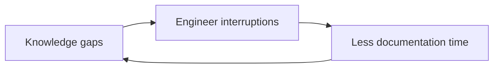

# Product Requirements Document

## 1. Product Name

**Working title:** Reasoning Skills Pack for Claude Code and Codex

---

## 2. Product Vision

Create a reusable set of agent skills that help Claude Code or Codex analyze and solve business and technical problems using appropriate reasoning frameworks.

The skills should prevent premature solutioning, improve problem framing, separate evidence from assumptions, and select suitable frameworks based on the nature of the problem.

The system should consist of:

1. **Problem Solving Skill**
2. **Systems Thinking Skill**
3. **Systemic Design Skill**
4. **Problem Router Skill**

The user interacts directly with Claude Code or Codex.

No dedicated UI is required.

---

# 3. Problem Statement

General-purpose coding agents can reason about business and technical problems, but they often:

- jump to solutions too early
- use inconsistent reasoning approaches
- fail to distinguish symptoms from root causes
- treat assumptions as facts
- overuse complex frameworks for simple problems
- fail to recognize systemic problems
- produce long prose without a reusable structure
- apply the same framework to every problem
- fail to preserve intermediate reasoning artifacts in a machine-readable form

The skill pack should make the reasoning process:

- systematic
- framework-aware
- evidence-oriented
- reusable
- composable
- machine-friendly

---

# 4. Primary Users

Primary users:

- software engineers
- technical leads
- solution architects
- business analysts
- product managers
- product owners
- consultants
- founders
- engineering managers
- operations leaders

---

# 5. Deployment Context

The skills must be usable inside:

- Claude Code
- Codex CLI / Codex agent environment

The skills should not depend on:

- a custom web application
- a graphical interface
- React
- browser state
- proprietary database infrastructure

The primary interface is:

```text
User prompt
   ↓
Agent
   ↓
Skill selection
   ↓
Structured reasoning
   ↓
Markdown / JSON artifacts
```

---

# 6. Core Product Principles

## 6.1 Do Not Jump to Solutions

Before proposing solutions, the agent should determine whether the problem is sufficiently understood.

If not, it should:

- identify missing information
- state assumptions
- ask high-value questions when interaction is possible
- otherwise proceed with explicit uncertainty

---

## 6.2 Choose the Simplest Suitable Method

The system should not apply Systems Thinking or Systemic Design when a simpler method is sufficient.

Example:

```text
Simple null pointer bug
→ direct debugging / RCA

Not:
→ Iceberg Model
→ Causal Loop Diagram
→ Systemic Design
```

---

## 6.3 Evidence Must Be Separated From Assumptions

The agent must distinguish:

- fact
- evidence
- assumption
- hypothesis
- interpretation
- recommendation

---

## 6.4 Frameworks Are Tools

The agent should select a framework because it fits the problem, not because it is available.

---

## 6.5 Outputs Must Be Reusable

Every skill should produce structured output suitable for:

- human review
- future agent runs
- Markdown storage
- JSON processing
- downstream skills

---

# 7. Skill Architecture

Recommended structure:

```text
skills/
├── problem-router/
│   └── SKILL.md
│
├── problem-solving/
│   ├── SKILL.md
│   └── frameworks/
│       ├── double-diamond.md
│       ├── root-cause-analysis.md
│       ├── five-whys.md
│       ├── a3.md
│       ├── pdca.md
│       ├── dmaic.md
│       ├── ooda.md
│       └── triz.md
│
├── systems-thinking/
│   ├── SKILL.md
│   └── frameworks/
│       ├── iceberg.md
│       ├── system-map.md
│       ├── causal-loop.md
│       ├── stock-and-flow.md
│       └── leverage-points.md
│
└── systemic-design/
    ├── SKILL.md
    └── frameworks/
        ├── systemic-design-framework.md
        ├── theory-of-change.md
        ├── three-horizons.md
        ├── transition-design.md
        └── service-ecosystem-design.md
```

---

# 8. Problem Router Skill

## 8.1 Purpose

Classify the problem and decide which reasoning skill should be used.

## 8.2 Problem Classes

### Simple / Bounded

Characteristics:

- narrow scope
- direct cause likely
- few dependencies
- low uncertainty

Route to:

- direct solve
- RCA
- 5 Whys
- PDCA

---

### Ambiguous

Characteristics:

- problem definition unclear
- user need unclear
- multiple possible interpretations
- solution space unclear

Route to:

- Problem Solving Skill
- often Double Diamond

---

### Complex

Characteristics:

- multiple actors
- recurring patterns
- cross-functional dependencies
- feedback loops
- problem reappears after local fixes

Route to:

- Systems Thinking Skill
- optionally followed by Problem Solving Skill

---

### Complex Adaptive

Characteristics:

- multiple independent actors
- system responds to interventions
- behavior emerges over time
- outcome cannot be controlled directly
- long-term transformation required

Route to:

- Systems Thinking
- then Systemic Design

---

# 9. Router Output

The router should produce:

```yaml
problem_class:
reasoning_skill:
recommended_framework:
confidence:
why:
frameworks_considered:
frameworks_rejected:
missing_information:
```

Example:

```yaml
problem_class: complex
reasoning_skill: systems-thinking
recommended_framework: iceberg-model
confidence: 0.84
why:
  - recurring operational issue
  - multiple teams involved
  - previous local fixes did not resolve it
frameworks_rejected:
  - framework: five-whys
    reason: too linear for the observed dependencies
```

---

# 10. Problem Solving Skill

## 10.1 Purpose

Help the agent move from a problem to a validated or testable solution.

---

## 10.2 Supported Frameworks

Minimum initial set:

- Double Diamond
- Root Cause Analysis
- 5 Whys
- A3 Problem Solving
- PDCA

Later:

- DMAIC
- OODA
- TRIZ
- Design Sprint

---

## 10.3 Framework Selection Logic

Example:

```text
Problem unclear?
→ Double Diamond

Symptom clear, cause unclear?
→ RCA / 5 Whys

Operational improvement?
→ A3 / PDCA

Data-heavy defect reduction?
→ DMAIC

Rapidly changing environment?
→ OODA

Engineering contradiction?
→ TRIZ
```

---

# 11. Double Diamond Behavior

The skill should follow:

```text
Discover
→ Define
→ Develop
→ Deliver
```

Expected outputs:

### Discover

- known facts
- user/stakeholder needs
- evidence
- constraints
- unknowns
- observations

### Define

- patterns
- key findings
- reframed problem
- scope
- success criteria

### Develop

- solution options
- trade-offs
- hypotheses
- risks

### Deliver

- recommended experiment
- measurement plan
- decision criteria

The skill should not treat Deliver as immediate full implementation.

---

# 12. Root Cause Analysis Behavior

Expected structure:

```text
Symptom
↓
Immediate causes
↓
Contributing causes
↓
Underlying causes
↓
Root causes
↓
Corrective actions
```

The agent must avoid labeling a cause as "root cause" without supporting reasoning.

---

# 13. 5 Whys Behavior

Use only when:

- causal chain is relatively linear
- scope is narrow
- dependencies are limited

Do not use as the primary method for highly interconnected systems.

Output:

```yaml
problem:
why_chain:
root_candidate:
evidence:
uncertainties:
```

---

# 14. A3 Behavior

Output structure:

```text
1. Background
2. Current Condition
3. Problem Statement
4. Target Condition
5. Root Cause Analysis
6. Countermeasures
7. Action Plan
8. Follow-Up
```

---

# 15. PDCA Behavior

Output:

```text
Plan
Do
Check
Act
```

The skill should explicitly define:

- hypothesis
- test
- metric
- expected result
- actual result
- next action

---

# 16. Systems Thinking Skill

## 16.1 Purpose

Understand how system structures, relationships, and feedback mechanisms generate observed behavior.

The skill should answer:

> What system is producing this problem?

---

# 17. Systems Thinking Frameworks

Minimum initial set:

- Iceberg Model
- System Map
- Causal Loop Diagram
- Leverage Points

Later:

- Stock and Flow
- Rich Picture

---

# 18. Systems Thinking Framework Selection

Example:

```text
Recurring symptom?
→ Iceberg Model

Need actors and relationships?
→ System Map

Need feedback analysis?
→ Causal Loop Diagram

Need intervention points?
→ Leverage Points

Need accumulation over time?
→ Stock and Flow
```

---

# 19. Iceberg Model Behavior

Output levels:

```text
Event
↓
Patterns / Trends
↓
Structures
↓
Mental Models
```

The agent must clearly separate observed evidence from inferred structures and beliefs.

Example schema:

```yaml
event:
patterns:
structures:
mental_models:
evidence:
assumptions:
open_questions:
```

---

# 20. System Map Behavior

The skill should identify:

- actors
- processes
- technologies
- policies
- incentives
- information flows
- dependencies
- constraints

Output:

```yaml
system_boundary:
actors:
components:
relationships:
dependencies:
external_factors:
```

---

# 21. Causal Loop Behavior

The skill should identify:

- causal variables
- direction of influence
- reinforcing loops
- balancing loops
- delays

Output should support Mermaid.

Example:



The skill must distinguish between:

- correlation
- hypothesized causation
- evidenced causation

---

# 22. Leverage Points Behavior

The skill should identify intervention opportunities at different depths.

Example categories:

- parameters
- information flows
- rules
- incentives
- system structure
- goals
- mental models

Output:

```yaml
leverage_points:
  - intervention:
    level:
    expected_effect:
    risks:
    evidence:
```

---

# 23. Systemic Design Skill

## 23.1 Purpose

Design coordinated interventions that change the behavior of a complex system.

Systems Thinking primarily analyzes the system.

Systemic Design asks:

> How should the system be changed?

---

# 24. Systemic Design Frameworks

Minimum initial set:

- Systemic Design Framework
- Theory of Change
- Three Horizons

Later:

- Transition Design
- Service / Ecosystem Design

---

# 25. Systemic Design Framework Behavior

Default process:

```text
Explore
↓
Reframe
↓
Create
↓
Catalyse
```

---

## 25.1 Explore

Outputs:

- system context
- actors
- behaviors
- structures
- tensions
- constraints

---

## 25.2 Reframe

Outputs:

- reframed challenge
- system boundaries
- desired change
- intervention principles

---

## 25.3 Create

Outputs:

- intervention portfolio
- dependencies
- potential unintended effects
- experiments

---

## 25.4 Catalyse

Outputs:

- adoption plan
- sequencing
- ownership
- feedback mechanisms
- success measures

---

# 26. Theory of Change Behavior

Use when the user needs a clear chain from action to outcome.

Output:

```text
Inputs
↓
Activities
↓
Outputs
↓
Short-term Outcomes
↓
Long-term Outcomes
↓
Impact
```

Must include assumptions between stages.

---

# 27. Three Horizons Behavior

Use when the problem concerns transition from current state to future state.

Output:

```text
Horizon 1
Current dominant system

Horizon 2
Transition innovations

Horizon 3
Desired future system
```

---

# 28. Skill Composition

Skills should be composable.

Example:

```text
Router
↓
Systems Thinking
↓
Iceberg Model
↓
Reframed problem
↓
Problem Solving
↓
Double Diamond
↓
Solution experiment
```

Another example:

```text
Router
↓
Systems Thinking
↓
System Map
↓
Leverage Points
↓
Systemic Design
↓
Theory of Change
```

---

# 29. Standard Analysis Contract

All skills should produce a common structured result.

Recommended schema:

```yaml
problem:
problem_class:
framework_used:
framework_reason:
context:
facts:
evidence:
assumptions:
unknowns:
findings:
causes:
system_dynamics:
reframed_problem:
options:
interventions:
risks:
experiments:
recommendations:
open_questions:
next_steps:
```

Not all fields must be populated.

---

# 30. Evidence Model

Every claim should optionally reference evidence.

Example:

```yaml
finding:
  statement: "Proposal delays are primarily caused by engineering dependency."
  support:
    - evidence_01
    - evidence_04
  confidence: medium
```

Evidence types:

- user-provided fact
- document
- log
- metric
- interview
- observation
- external source
- inferred

Inferred information must not be labeled as fact.

---

# 31. Confidence Model

Use qualitative confidence by default:

```text
low
medium
high
```

Optional numeric confidence may be used internally but must not create false precision.

Confidence should depend on:

- evidence quantity
- evidence quality
- contradiction
- inference depth

---

# 32. Question Strategy

When clarification is possible, ask only high-value questions.

Prioritize questions that materially change:

- problem classification
- framework selection
- root cause
- system boundary
- intervention choice

Avoid exhaustive interviews before producing any value.

---

# 33. Non-Interactive / Headless Mode

Claude Code or Codex may run without user interaction.

In that case:

1. state missing information
2. make explicit assumptions
3. proceed with provisional analysis
4. flag what requires validation

Example:

```yaml
assumptions:
  - statement: "The issue occurs across most projects."
    status: unverified
```

---

# 34. Artifact Output

The skill pack should primarily output:

- Markdown
- YAML
- JSON
- Mermaid

No Word, spreadsheet, or slide generation is required in this version.

---

# 35. Markdown Artifact Types

Initial reusable artifacts:

```text
problem-analysis.md
system-analysis.md
intervention-strategy.md
experiment-plan.md
decision-record.md
```

---

# 36. Mermaid Support

Use Mermaid when diagrams add value.

Supported diagrams may include:

- causal maps
- process flows
- problem trees
- intervention maps
- system relationships

Do not generate diagrams merely for decoration.

---

# 37. Machine-Friendly Output

When downstream automation is expected, output JSON or YAML alongside Markdown.

Example:

```json
{
  "problem_class": "complex",
  "framework_used": "iceberg",
  "reframed_problem": "...",
  "interventions": []
}
```

---

# 38. Claude Code Compatibility

The skill definitions should be usable as Claude Code skills or instruction modules.

Each skill should define:

```text
Purpose
Triggers
When to use
When not to use
Inputs
Process
Framework selection
Output contract
Failure modes
Examples
```

Avoid relying on Claude-specific undocumented behavior.

---

# 39. Codex Compatibility

The skill pack must also work when called by Codex.

Requirements:

- plain Markdown skill definitions
- deterministic output schemas
- no dependency on Claude-only XML conventions
- no dependency on proprietary UI
- external tools accessed through explicit tool interfaces

---

# 40. Runtime Independence

Reasoning content should remain provider-neutral.

Avoid writing prompts such as:

> "Because you are Claude..."

Use:

> "You are executing the Systems Thinking skill."

---

# 41. Suggested Invocation

Example:

```text
Analyze this problem using the problem-router skill.

Problem:
Our engineering delivery is still slow even after increasing team size.
```

Or:

```text
Use the systems-thinking skill.
Choose the most suitable framework automatically.
Do not jump to solutions.
```

Or:

```text
Use the full reasoning pipeline:
router → analysis → intervention design.
Return both Markdown and structured YAML.
```

---

# 42. Guardrails

The skills must avoid:

- forcing frameworks unnecessarily
- inventing evidence
- treating assumptions as facts
- claiming certainty without evidence
- jumping to implementation too early
- excessive framework stacking
- generating unnecessary diagrams
- confusing Systemic Design with software System Design

---

# 43. Framework Stopping Rules

Each framework needs a stopping condition.

Example:

### Double Diamond

Stop discovery when:

- key uncertainty is understood
- evidence is sufficient to define the problem
- remaining unknowns are unlikely to change the framing

### 5 Whys

Stop when:

- further "why" becomes speculative
- cause is outside scope
- evidence no longer supports causal inference

### Systems Thinking

Stop expansion when:

- system boundary is useful
- primary loops and structures are understood
- additional nodes do not materially change intervention choices

---

# 44. Evaluation Strategy

The skill pack must include evals from the beginning.

Two categories:

```text
Skill correctness
Reasoning quality
```

---

# 45. Routing Evals

Dataset should include:

- simple bug
- ambiguous product problem
- recurring business process problem
- multi-team bottleneck
- distributed system failure
- complex adaptive organizational change

Evaluate:

- correct problem class
- acceptable framework
- inappropriate frameworks avoided

---

# 46. Framework Evals

Examples:

### Iceberg

Check:

- event identified
- pattern distinguished from event
- structure identified
- mental model not invented as fact

### Double Diamond

Check:

- exploration before solutioning
- explicit problem reframing
- multiple solution options
- testable delivery step

---

# 47. Safety / Quality Evals

Measure:

- hallucinated evidence rate
- unsupported root cause rate
- over-analysis rate
- framework misuse rate
- assumption/fact confusion rate
- missing uncertainty rate

---

# 48. Example Eval Case

```yaml
id: eval_technical_001

input: "A button crashes because user.profile is null."

expected:
  problem_class:
    - simple
    - bounded

acceptable_frameworks:
  - direct-debugging
  - root-cause-analysis

forbidden_frameworks:
  - systemic-design
  - causal-loop
  - three-horizons
```

---

# 49. Example Complex Eval

```yaml
id: eval_org_001

input:
  "Engineering delivery remains slow even though the company added more engineers.
  Coordination overhead increased and senior engineers are constantly interrupted."

expected:
  problem_class:
    - complex

acceptable_frameworks:
  - iceberg
  - system-map
  - causal-loop

required_concepts:
  - dependencies
  - recurring-pattern
  - system-structure

forbidden_behavior:
  - immediately recommend hiring more engineers
```

---

# 50. Skill Tests

Each skill should include tests for:

- framework routing
- schema validation
- required output sections
- prohibited output behavior
- malformed input
- incomplete context

---

# 51. MVP Scope

The first release should include:

## Router

- simple
- ambiguous
- complex
- complex adaptive classification

## Problem Solving

- Double Diamond
- RCA
- 5 Whys
- A3
- PDCA

## Systems Thinking

- Iceberg
- System Map
- Causal Loop
- Leverage Points

## Systemic Design

- Explore / Reframe / Create / Catalyse
- Theory of Change
- Three Horizons

## Output

- Markdown
- YAML
- Mermaid

## Quality

- basic eval dataset
- routing tests
- framework tests

---

# 52. Explicit Non-Goals

Do not initially build:

- autonomous multi-agent swarm
- graphical UI
- React Flow
- persistent database
- Temporal workflows
- Langfuse integration
- automatic PowerPoint generation
- automatic Word generation
- automatic spreadsheet generation
- graph database
- organization-wide memory

---

# 53. Recommended File Structure

```text
reasoning-skills/
├── README.md
├── router/
│   ├── SKILL.md
│   └── examples/
│
├── problem-solving/
│   ├── SKILL.md
│   ├── frameworks/
│   └── examples/
│
├── systems-thinking/
│   ├── SKILL.md
│   ├── frameworks/
│   └── examples/
│
├── systemic-design/
│   ├── SKILL.md
│   ├── frameworks/
│   └── examples/
│
├── schemas/
│   ├── analysis-result.schema.json
│   └── router-result.schema.json
│
└── evals/
    ├── cases/
    ├── expected/
    └── README.md
```

---

# 54. Definition of Done

The MVP is complete when:

1. Claude Code can invoke the router and correctly choose a reasoning path.
2. Codex can use the same skill definitions.
3. The three core skills can run independently.
4. Frameworks are selected conditionally rather than always executed.
5. Outputs follow a stable schema.
6. Evidence and assumptions are clearly separated.
7. Simple problems do not trigger systemic analysis unnecessarily.
8. Complex problems can compose multiple skills.
9. Mermaid diagrams are generated when useful.
10. A basic eval suite verifies routing and reasoning quality.

---

# 55. Core Product Hypothesis

> A coding agent equipped with explicit problem-solving, systems-thinking, and systemic-design skills will produce more reliable and reusable analysis than a general-purpose agent relying only on ad hoc prompting.

---

# 56. Key Design Decision

The most important design choice is:

> **Build the capabilities as composable skills, not separate autonomous agents.**

The router decides which skill to invoke.

Each skill selects its own framework.

Frameworks are implementation methods inside the skill, not standalone agents.

This keeps the system:

- lightweight
- portable
- provider-neutral
- easy to evaluate
- easy to version
- easy to reuse inside Claude Code and Codex
