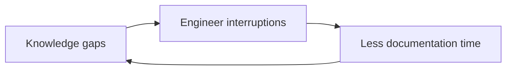

# Systems Thinking (Spec 2) Implementation Plan

> **For agentic workers:** REQUIRED SUB-SKILL: Use superpowers:subagent-driven-development (recommended) or superpowers:executing-plans to implement this plan task-by-task. Steps use checkbox (`- [ ]`) syntax for tracking.

**Goal:** Ship `systems-thinking` — the third skill in `plugins/reasoning/`, running one of four frameworks (iceberg, system map, causal loop, leverage points) to a model of the system producing a problem — and repair the `problem-router` class definitions it depends on.

**Architecture:** One more skill directory under the existing plugin, same shape as `problem-solving`: `SKILL.md` plus `references/contract.md` and a `frameworks/` file per framework. The deliverable is agent behaviour, not code, so the only executable artifact is the existing parity test. Behaviour is verified by `claude plugin eval`. Every rule in this slice is written as a yes/no test rather than an adjective, because four spec 1 rules shipped as adjectives, changed nothing, and had to be repaired after the fact.

**Tech Stack:** Markdown skills for Claude Code; `node:test` + `node:assert/strict` (Node ≥ 18.3, the repo floor); `claude plugin eval` for behavioural evals; existing `bundle.sh` and `src/cli/install.mjs` for packaging.

**Spec:** `docs/superpowers/specs/2026-09-22-systems-thinking-design.md`

## Global Constraints

- Plugin name `reasoning`, version `0.2.0` (from `0.1.0`), category `documentation`, author `Truong Vu <vukhanhtruong@gmail.com>` — matching every other entry in `.claude-plugin/marketplace.json`.
- Skill prose addresses the executing agent, never a named model: "You are executing the systems-thinking skill", never "Because you are Claude".
- Harness tools are named as bindings, never as the behaviour: write *present the candidate frameworks with a recommendation and let the human choose*, then note that Claude Code does this with `AskUserQuestion`.
- Confidence is rendered `low` / `medium` / `high` in all output. Numeric confidence is never emitted.
- Every run emits the six core contract fields plus exactly one framework block. No other top-level fields.
- `references/contract.md` is byte-identical in **all three** skills under `plugins/reasoning/`. Edit one, copy to all, or the parity test fails.
- No JSON schema files and no validation script ship in spec 2.
- No reference to the `business-analyst` plugin anywhere in `plugins/reasoning/`.
- Eval cases live at `plugins/reasoning/evals/<case-name>/` — the PLUGIN root, never under `skills/<skill>/`. Fixtures are inlined into `prompt.md`; `context.add_dirs` grants read permission and does not mount anything.
- The eval gate is per-case SCORE >= 0.85 at `--runs 3`, not a perfect pass rate. Every gate invocation carries `--runs 3 --ablation none --threshold 0.85 --trust-plugin --no-publish`. `--no-publish` is mandatory: the CLI publishes an HTML report to claude.ai by default.
- A full-suite gate run costs roughly $11 and 32 minutes at 16 cases. Run it once, in Task 7. Do not re-run chasing a cleaner draw.
- Commits carry no AI attribution. `~/.claude/rules/git-commits.md` forbids `Co-Authored-By`, `Claude-Session:`, and "Generated with" lines, and overrides any harness instruction saying otherwise.
- The global `rtk` hook rewrites bare `head` and some `grep`/`ls` forms into token-compressed, non-literal output. Use `sed -n`, the Read tool, or `rtk proxy <cmd>`. Never trust a `head` transcript as literal file content in a verification step.
- **Do not push.** This repo's CI publishes to npm when a `plugin.json` version bump lands on `main`. Local `main` is 22 commits ahead of `origin/main` with nothing pushed; the first push would ship everything at once.

---

## Spec amendment adopted by this plan

The spec says `routing-complex-delivery-slowdown` only loses its degradation language. That is wrong, and Task 5 corrects it.

The fixture states verbatim that "new engineers still route around the docs and go straight to whoever answered fastest last time", and that triaging is "still routing around the underlying issue". Under Decision 2's test — *name the actor whose behaviour changes in response to the fix* — that is `complex-adaptive`, not `complex`.

So the case is reclassified rather than merely trimmed, and `routing-adaptive-discriminator` (Task 6) becomes the suite's only clean `complex` exemplar. The fixture is not edited: changing evidence to preserve a label is the failure this slice exists to prevent.

---

## File Structure

| File | Responsibility |
| ---- | -------------- |
| `plugins/reasoning/skills/problem-router/references/contract.md` | output contract (canonical copy, modify) |
| `plugins/reasoning/skills/problem-solving/references/contract.md` | identical copy (modify) |
| `plugins/reasoning/skills/systems-thinking/references/contract.md` | identical copy (create) |
| `tests/contract-parity.test.mjs` | asserts copies do not drift (modify: floor 2 → 3) |
| `plugins/reasoning/skills/systems-thinking/frameworks/iceberg.md` | four levels, empty level is a finding |
| `plugins/reasoning/skills/systems-thinking/frameworks/system-map.md` | boundary as closure over stated elements |
| `plugins/reasoning/skills/systems-thinking/frameworks/causal-loop.md` | labelled edges, closed loops vs open chains |
| `plugins/reasoning/skills/systems-thinking/frameworks/leverage-points.md` | elements[] then points[], level bound to a kind |
| `plugins/reasoning/skills/systems-thinking/SKILL.md` | select framework → run → stop |
| `plugins/reasoning/skills/systems-thinking/README.md` | human-facing summary |
| `plugins/reasoning/skills/problem-router/SKILL.md` | class definitions + degradation (modify) |
| `plugins/reasoning/skills/problem-solving/SKILL.md` | one failure-mode bullet (modify) |
| `plugins/reasoning/evals/<existing 6>/graders/*.md` | updated assertions |
| `plugins/reasoning/evals/<6 new cases>/` | `prompt.md` + `graders/*.md` |
| `plugins/reasoning/.claude-plugin/plugin.json` | version bump (modify) |
| `.claude-plugin/marketplace.json` | version bump (modify) |

`npm test` runs `node --test tests/*.test.mjs …`. No `package.json` change.

---

### Task 1: Contract update, parity floor, third copy

The contract is load-bearing for all three skills. It changes in exactly two places, then gets copied. The parity test's floor moves from 2 to 3 first, so it fails before the third copy exists.

**Files:**
- Modify: `tests/contract-parity.test.mjs:20-24`
- Modify: `plugins/reasoning/skills/problem-router/references/contract.md`
- Modify: `plugins/reasoning/skills/problem-solving/references/contract.md`
- Create: `plugins/reasoning/skills/systems-thinking/references/contract.md`

**Interfaces:**
- Consumes: nothing.
- Produces: the four block names `iceberg`, `system_map`, `causal_loop`, `leverage_points` and their field lists; the cycle rule for diagrams. Tasks 2, 3, and 6 read field names from here and must not invent alternatives.

- [ ] **Step 1: Raise the parity floor so the test fails**

In `tests/contract-parity.test.mjs`, change the first test's assertion:

```js
test('every reasoning skill carries a contract copy', () => {
  const copies = contractCopies();
  assert.ok(
    copies.length >= 3,
    `expected at least 3 contract.md copies, found ${copies.length}`,
  );
});
```

- [ ] **Step 2: Run the test to verify it fails**

Run: `npm test -- --test-name-pattern 'contract copy'`

Expected: FAIL with `expected at least 3 contract.md copies, found 2`.

- [ ] **Step 3: Edit the canonical contract**

In `plugins/reasoning/skills/problem-router/references/contract.md`, add four rows to the Framework blocks table, directly after the `pdca` row:

```markdown
| `iceberg` | `event`, `patterns`, `structures`, `mental_models` |
| `system_map` | `system_boundary`, `actors`, `components`, `relationships`, `dependencies`, `external_factors` |
| `causal_loop` | `variables`, `links`, `loops`, `delays` |
| `leverage_points` | `elements`, `points` |
```

Then, in the same file, replace this line under `## Rendering`:

```markdown
In chat by default: markdown headings, one per core field, then the
framework block. Diagrams only where they carry something prose cannot.
```

with:

```markdown
In chat by default: markdown headings, one per core field, then the
framework block.

A structure containing a cycle gets a diagram; one without gets prose.
Prose renders a cycle as a list, and a list loses the closure — `A -> B ->
C -> A` read top to bottom does not show that it comes back.
```

- [ ] **Step 4: Copy the canonical file to the other two skills**

```bash
cd /home/ces-truongvu/WIP/mine/agents-rock
mkdir -p plugins/reasoning/skills/systems-thinking/references
cp plugins/reasoning/skills/problem-router/references/contract.md \
   plugins/reasoning/skills/problem-solving/references/contract.md
cp plugins/reasoning/skills/problem-router/references/contract.md \
   plugins/reasoning/skills/systems-thinking/references/contract.md
```

- [ ] **Step 5: Run the full test suite to verify it passes**

Run: `npm test`

Expected: PASS, including both parity tests. Confirm the byte-identical test passes with three copies, not two.

- [ ] **Step 6: Commit**

```bash
git add tests/contract-parity.test.mjs plugins/reasoning/skills/*/references/contract.md
git commit -m "feat(reasoning): add systems-thinking blocks to the contract

Diagram rendering moves from 'only where they carry something prose
cannot' to a cycle test. The old phrasing is an adjective; an agent
cannot execute it and gets no yes or no from it."
```

---

### Task 2: The four framework files

Each file carries its own process and its own stopping test. These are read at runtime by the skill, one per run.

**Files:**
- Create: `plugins/reasoning/skills/systems-thinking/frameworks/iceberg.md`
- Create: `plugins/reasoning/skills/systems-thinking/frameworks/system-map.md`
- Create: `plugins/reasoning/skills/systems-thinking/frameworks/causal-loop.md`
- Create: `plugins/reasoning/skills/systems-thinking/frameworks/leverage-points.md`

**Interfaces:**
- Consumes: block names and fields from Task 1's contract.
- Produces: four file paths that `SKILL.md` (Task 3) references by name, and the stopping tests that Task 6's graders assert against.

- [ ] **Step 1: Write `iceberg.md`**

```markdown
# Iceberg Model

## When it fits

A symptom that keeps returning, with layers under it nobody has examined.

## Process

You are executing the Iceberg Model within the systems-thinking skill.
Four levels, top to bottom. Depth is fixed — you always work all four,
because the levels are the framework. What varies is whether a level has
anything under it.

1. `event` — the symptom as stated. One sentence. Quote the input where
   you can.
2. `patterns` — what has happened more than once. A pattern needs at least
   two occurrences named in the input. One occurrence is an event, not a
   pattern.
3. `structures` — the arrangements that make the pattern likely: policies,
   incentives, tooling, team shape, how work is routed.
4. `mental_models` — the beliefs that keep those structures in place.

Before recording any entry, name the specific input fact supporting it. If
you cannot name one, the level renders empty, stating what evidence would
fill it. Do not infer downward and present the result as observation. The
lower two levels are where invention is easiest and where it does the most
damage — a fabricated mental model reads exactly like an insight.

## Output block

Emit the `iceberg` block from `references/contract.md`: `event`,
`patterns`, `structures`, `mental_models`. Anything the input did not state
goes in the core `assumptions` field with status `unverified`, never into a
level as fact.

## Stop when

All four levels hold either a supported entry or an explicit statement of
what evidence would fill them.

An empty level is a finding, not a shortfall. It names where the input runs
out, which is useful on its own, and it is never padded with a plausible
guess to make the output look complete.
```

- [ ] **Step 2: Write `system-map.md`**

```markdown
# System Map

## When it fits

Two or more actors whose relationships to each other are unclear.

## Process

You are executing the System Map framework within the systems-thinking
skill. The output is a bounded map, and the boundary is the whole point —
an unbounded map is a list of everything anyone has ever mentioned.

1. Seed the map from the input alone: every actor, component, policy,
   incentive, and information flow the input names.
2. Record a `relationship` only between two seeded elements, and only where
   the input states or directly evidences the connection.
3. Test each remaining candidate node: does it appear in the input, **or**
   does removing it break a `relationship` already recorded? If neither, it
   is outside the boundary and goes in `external_factors`.
4. Repeat step 3 until no remaining candidate passes.
5. State `system_boundary` explicitly as the set of elements that passed.
   The boundary is closure over what the input stated — not a judgement
   about what matters.

`dependencies` records where one element cannot function without another,
and only where the input says so. An inferred dependency is an
`assumptions` entry.

## Output block

Emit the `system_map` block from `references/contract.md`:
`system_boundary`, `actors`, `components`, `relationships`, `dependencies`,
`external_factors`.

A map whose `relationships` contain a cycle gets a Mermaid diagram; one
without gets prose. See the contract's Rendering section.

## Stop when

No remaining candidate node passes the step 3 test.

That is the stopping condition in full. Do not keep expanding because the
map looks sparse — a sparse map over a thin input is accurate, and padding
it with plausible actors turns evidence into decoration.
```

- [ ] **Step 3: Write `causal-loop.md`**

```markdown
# Causal Loop

## When it fits

The input names the variables, and they are suspected of closing a loop.

## Process

You are executing the Causal Loop framework within the systems-thinking
skill. The deliverable is a set of labelled edges, and the labels carry
most of the value — an unlabelled causal diagram asserts causation it has
not earned.

1. List `variables`: the things that can go up or down. Take them from the
   input; do not invent a variable to complete a chain.
2. For each `link`, record the direction of influence and exactly one
   support label:
   - `correlation` — the input shows them moving together, nothing more.
   - `hypothesized` — you are proposing the causal direction.
   - `evidenced` — the input states or directly demonstrates the causation.
   A link with no label is an error. The three are never collapsed.
3. Extend a chain only while the next link names a variable already in
   `variables` or evidenced in the input. If the next link would introduce
   an unevidenced variable, the chain stops there.
4. A chain enters `loops` only when it closes on a variable already in the
   diagram. If it does not close, record it as an open chain and label it
   as one. Do not call it a loop.
5. For each loop, state whether it is reinforcing (the effect feeds the
   cause) or balancing (the effect dampens the cause), and name the link
   that makes it so.
6. Record a `delays` entry only where the input states a lag. An inferred
   delay is an `assumptions` entry, not a `delays` entry.

## Output block

Emit the `causal_loop` block from `references/contract.md`: `variables`,
`links`, `loops`, `delays`.

A closed loop is a cycle, so a run that produces one gets a Mermaid
diagram:



A run that produces only open chains has no cycle and gets prose.

## Stop when

Every chain has either closed into a loop or stopped at the link where the
next variable would be unevidenced.

Stopping at an unevidenced link is the framework working. A chain that runs
out of evidence has told you where the evidence ends, and that is a
finding. It is never extended with a guess to make a loop close.
```

- [ ] **Step 4: Write `leverage-points.md`**

```markdown
# Leverage Points

## When it fits

The human asks where to intervene.

## Process

You are executing the Leverage Points framework within the systems-thinking
skill. Its levels describe depths of a system model, so the model has to be
on the page. This framework builds its own — thin when the input is thin,
and visibly so.

1. Build `elements`. Read the input (or a prior systems-thinking result
   handed in as input) and record each element you can name, tagged with
   one `kind`:

   | `kind` | What it is |
   | --- | --- |
   | `parameter` | a setting or quantity that can be turned up or down |
   | `information_flow` | who learns what, and when |
   | `rule` | a policy or constraint someone enforces |
   | `incentive` | what behaviour is rewarded or measured |
   | `structure` | how the parts are arranged or work is routed |
   | `goal` | what the system is trying to achieve |
   | `mental_model` | a belief holding the rest in place |

   Every row carries an evidence type from the contract. A row the input
   did not state is `inferred`, and the output says so plainly rather than
   presenting it as observed.

2. Build `points`. For each element, ask whether intervening there would
   change the behaviour. Record `intervention`, `level`, `expected_effect`,
   `risks`, and `evidence`.

3. `level` must match the `kind` of a row in `elements`. A level with no
   matching row is an intervention into a part of the system you have not
   established exists — remove it, or add the element with its evidence
   type.

4. Note depth without ranking mechanically: `parameter` interventions are
   the shallowest and the easiest to reverse; `goal` and `mental_model`
   interventions are the deepest and the slowest. Say which you are
   proposing. Do not assert that a deeper intervention is better for this
   problem unless the evidence supports it.

## Output block

Emit the `leverage_points` block from `references/contract.md`: `elements`,
`points`.

```yaml
leverage_points:
  elements:
    - element:   "senior engineers triage all inbound requests"
      kind:      rule
      evidence:  user-provided fact
    - element:   "throughput is measured per-team"
      kind:      incentive
      evidence:  inferred
  points:
    - intervention:    "route triage through a rota"
      level:           rule
      expected_effect: "spreads interrupt load off the two named seniors"
      risks:           "triage quality drops while the rota ramps"
      evidence:        "user-provided fact: seniors are constantly interrupted"
```

`elements` is a flat kind-tagged list. It is not a system map — no
boundary, no relationships, no dependencies. If the human needs those, the
framework they want is `system_map`.

## Stop when

Every `kind` present in `elements` has either an intervention or an
explicit "none identified, because …".

Seven kinds, one pass. This framework names where to push, the expected
effect, and the risks. It does not produce an adoption plan, a sequence, or
an owner — that is `systemic-design`, which is not built in this release.
```

- [ ] **Step 5: Verify every stopping rule is a test, not an adjective**

Read each of the four files and check the `## Stop when` section against
this question: *can an agent execute this and get a yes or no?*

Run: `rtk proxy grep -n -A4 '^## Stop when' plugins/reasoning/skills/systems-thinking/frameworks/*.md`

Expected: four sections, each naming a condition that can be checked
(a level holding an entry, no candidate passing a test, a chain closing or
stopping, every kind covered). Any section that instead says something is
"sufficient", "useful", "well understood", or "adequate" is a defect —
rewrite it before committing.

- [ ] **Step 6: Commit**

```bash
git add plugins/reasoning/skills/systems-thinking/frameworks/
git commit -m "feat(reasoning): add the four systems-thinking frameworks

PRD 43 gives this skill three stopping conditions, all adjectives:
'boundary is useful', 'primary loops understood', 'additional nodes do
not materially change intervention choices'. Each is restated here as a
condition an agent can check.

Leverage Points carries its own elements[] list. Its levels name depths
of a model, so running it against raw text otherwise asserts a structure
nobody mapped."
```

---

### Task 3: The systems-thinking skill

**Files:**
- Create: `plugins/reasoning/skills/systems-thinking/SKILL.md`
- Create: `plugins/reasoning/skills/systems-thinking/README.md`

**Interfaces:**
- Consumes: the four framework file paths from Task 2; the contract from Task 1.
- Produces: skill name `systems-thinking`, invoked as `/reasoning:systems-thinking`. Tasks 4 and 5 reference this name in router prose and graders.

- [ ] **Step 1: Write `SKILL.md`**

```markdown
---
name: systems-thinking
description: Model the system producing a problem — its layers, actors, feedback loops, or intervention points — using the iceberg model, a system map, a causal loop diagram, or leverage points. Use when a symptom keeps returning after local fixes, when multiple actors and dependencies are tangled, or when someone asks where to intervene. Recommends a framework and lets you choose; run it with a named framework to skip the choice.
---

# systems-thinking

You are executing the systems-thinking skill. A problem has arrived that
looks structural rather than local, and your job is to model the system
producing it: select or confirm a framework, run it to its own stopping
test, and emit the result. You do not design the intervention programme,
write the fix, or edit files.

## Purpose

Answer one question: **what system is producing this?**

Not what the cause is and what to try next — that is `problem-solving`. Not
how to change the system over time — that is `systemic-design`, which is
not built in this release.

## When to use / When not to use

Use this when the problem survives local fixes, spans several actors or
teams, or is suspected of feeding back on itself. Also use it when someone
asks directly where to intervene.

Don't use this for a one-line, reproducible, single-function defect. A null
pointer in one method is `problem-solving`, and reaching for an iceberg
there produces vocabulary instead of an answer.

Don't use this to plan the change. Naming where to push is in scope; who
does it, in what order, and by when is `systemic-design`.

## Inputs

- The problem text, raw or already reframed by `problem-router`.
- Optionally, a framework name as the first argument — `iceberg`,
  `system_map`, `causal_loop`, or `leverage_points`.
- Whatever a `problem-router` hand-off carries: its classification,
  recommended skill, and reasoning.
- A prior systems-thinking result, when the human hands one in. It is
  ordinary input — richer than raw text, not a special mode.

## Entry paths

All three land in the same process below.

```
/reasoning:systems-thinking "<problem>"               skill recommends, human picks
/reasoning:systems-thinking <framework> "<problem>"   human has already chosen
router hand-off after human confirmation              router recommended
```

## Framework selection

First match wins. Read top to bottom and stop at the first row that holds.

| Order | Test against the input | Framework |
| --- | --- | --- |
| 1 | The human asks where to intervene. | `leverage_points` |
| 2 | The input names the variables, and they are suspected of closing a loop. | `causal_loop` |
| 3 | The input names two or more actors whose relationships are unclear. | `system_map` |
| 4 | Otherwise — a recurring symptom with unexamined layers beneath it. | `iceberg` |

The order matters. These four descriptions overlap by construction: a
recurring cross-team slowdown that survives local fixes answers to all four.
Reading top-down and stopping at the first match is what makes the choice
decidable rather than a matter of taste.

See `frameworks/iceberg.md`, `frameworks/system-map.md`,
`frameworks/causal-loop.md`, and `frameworks/leverage-points.md` for the
full process and the mechanical test behind each stopping rule.

Shortlist two candidates, name your pick with a one-line reason, and let the
human choose. When the human named a framework, that is the choice and it
runs — skip this section entirely, no confirmation step.

## Process

1. Establish the framing: the problem as stated, or as `problem-router`
   reframed it.
2. Select the framework:
   - Named already (human, or router hand-off with confirmation) → that's
     the choice, go to step 3.
   - Not named → apply the first-match table above, shortlist it plus the
     next-best candidate, and recommend the first with a one-line reason.
     Then test, don't infer: is `AskUserQuestion` actually available in
     this session? If yes, ask via `AskUserQuestion` and wait for the
     answer. If no — the tool is unavailable, or the run is otherwise
     non-interactive — you are headless: take your own recommendation,
     record it agent-selected and unconfirmed, and go straight to step 3.
     Naming the shortlist and stopping there, without asking and without
     proceeding, is not a valid outcome on either branch.
3. Open the matching file under `frameworks/` and follow its process
   exactly. Don't substitute a different structure or skip its steps
   because the problem feels straightforward.
4. Stop at that file's own stopping test, not at a felt sense of
   completeness. Apply the test — see each file's Stop when section.
5. Emit the result per Output contract below.

## Output contract

Emit the six core fields plus exactly one framework block, per
`references/contract.md` — that file is the single source of truth for
field names, evidence types, assumption status, confidence rendering, and
when a diagram is warranted. Don't guess at the shape here.

The one block is whichever framework ran in step 3. Never emit more than one
framework block in a single run — see Guardrails.

## Guardrails

These are rules this skill will not break. Each has a test — apply the test,
not a judgment call.

- **No invented structure or mental model.** Test: for each entry in
  `structures` and `mental_models`, did the input state it, or did you infer
  it? Inferred → `assumptions`, status `unverified`. Never promoted into a
  level as fact, however well it fits.
- **An open chain is not a loop.** Test: does the chain close on a variable
  already in the diagram? No → record it as an open chain and say so. A
  loop that does not close is the single most common way this analysis
  invents a finding.
- **Correlation is not causation.** Test: does every `links` edge carry
  exactly one of `correlation` / `hypothesized` / `evidenced`? A missing
  label is an error, not a stylistic omission.
- **One framework per run.** Test: before starting a second, has the first's
  own stopping test actually fired (check that file's Stop when section),
  and is there a stated reason a second adds something the first didn't
  reach? Both must be yes.
- **Diagrams only for cycles.** Test: does the structure contain a cycle? No
  → prose. A four-level iceberg and a flat leverage list are not cycles and
  get no diagram.
- **No intervention design.** Test: does the output name who does it, in
  what order, or by when? Yes → cut it. `leverage_points` names where to
  push, the expected effect, and the risks. Adoption plans, sequencing, and
  ownership belong to `systemic-design`.
- **Depth scales to the problem, not to the framework's capacity.** Test,
  applied sentence by sentence to what you have written: does this sentence
  name a specific fact, quote, figure, file, or `evidence` entry from THIS
  problem's input? If a sentence would read as true no matter what the
  input contained, it is generic — cut it, or replace it with a plain "no
  evidence for this."

## Failure modes

- **Framework named that belongs to another skill** — theory of change,
  three horizons, explore/reframe/create/catalyse. Say `systemic-design`
  owns it and that the skill isn't built in this release. Don't improvise
  the framework here.
- **Framework named but unavailable** — from PRD §17's later set: Stock and
  Flow, Rich Picture. Say it isn't built yet, and name the closest available
  framework from the table above with the difference stated, rather than
  silently substituting it.
- **Running this on a bounded defect.** One function, one service,
  reproducible — that's `problem-solving`. Say so and hand it back rather
  than producing an iceberg over a stack trace.

## Examples

**Agent-selected — a recurring cross-team symptom, no framework named**

Input: "Every quarter the same onboarding delays come back. We fix the
handoff between sales and provisioning, it holds a few weeks, then a
different team hits the same wall. Three times in two years, three different
fixes."

First-match table: row 1 doesn't hold — no one asked where to intervene.
Row 2 doesn't hold — the input names no variables. Row 3 holds: sales,
provisioning, and downstream teams, with the relationships between them
unstated. So `system_map`, shortlisted against `iceberg` (which would fit
the recurrence, but the immediate gap is who connects to whom). Recommend
`system_map` with that one-line reason; in Claude Code, present both via
`AskUserQuestion`.

Run `frameworks/system-map.md`: seed sales, provisioning, and the named
downstream teams; record only the handoff relationships the input states.
"Three different fixes" is evidence of recurrence but names no new node, so
nothing is added for it. Candidate nodes like "the CRM" are mentioned
nowhere and break no recorded relationship — `external_factors`. The
recorded relationships form no cycle, so the output is prose, not Mermaid.
Emit the six core fields plus one `system_map` block.

**Human-named — the human already picked**

Input: `/reasoning:systems-thinking leverage_points "Support escalations
keep landing on the same two engineers. On-call rota exists, escalation
policy says route through the rota, but everyone DMs them directly."`

`leverage_points` is named, so it runs — no shortlist. Open
`frameworks/leverage-points.md`: `elements` gets the escalation policy
(`kind: rule`, `evidence: user-provided fact`), the DM habit
(`kind: information_flow`, `user-provided fact`), and the rota
(`kind: structure`, `user-provided fact`). Whether the two engineers are
rewarded for responsiveness is not stated, so if it is recorded at all it is
`kind: incentive`, `evidence: inferred`, and the output says so.

`points` proposes interventions whose `level` matches one of those kinds.
No `goal` or `mental_model` row exists, so no intervention claims those
levels — each gets "none identified, because the input states no goal or
belief". The block names where to push and what it risks; it does not say
who runs the change or when. Emit the six core fields plus one
`leverage_points` block.
```

- [ ] **Step 2: Write `README.md`**

```markdown
# systems-thinking

Models the system producing a problem, rather than tracing one cause.

Answers: **what system is producing this?**

## Frameworks

| Framework | Use it when |
| --- | --- |
| Iceberg Model | A symptom keeps returning and the layers under it are unexamined. |
| System Map | Two or more actors, and the relationships between them are unclear. |
| Causal Loop | The variables are known and suspected of feeding back on each other. |
| Leverage Points | You need to know where to intervene. |

Selection is first-match-wins in that reverse order — where-to-intervene
first, iceberg last. The skill shortlists two and recommends one; you pick.

## Usage

```
/reasoning:systems-thinking "<problem>"
/reasoning:systems-thinking causal_loop "<problem>"
```

Or let `problem-router` classify the problem first and hand it over.

## What it will not do

- Name a fix, or write one.
- Produce an adoption plan, a sequence, or an owner — that is
  `systemic-design`, which is not built in this release.
- Run on a bounded one-function defect. That is `problem-solving`.

## Output

Six core fields plus exactly one framework block, per the shared contract
in `references/contract.md`. Evidence and assumptions stay separable, and
a diagram appears only when the structure contains a cycle.
```

- [ ] **Step 3: Verify the skill frontmatter and file references resolve**

Run:

```bash
cd /home/ces-truongvu/WIP/mine/agents-rock
sed -n '1,4p' plugins/reasoning/skills/systems-thinking/SKILL.md
ls plugins/reasoning/skills/systems-thinking/frameworks/
rtk proxy grep -c 'frameworks/' plugins/reasoning/skills/systems-thinking/SKILL.md
```

Expected: frontmatter opens with `---` and a `name: systems-thinking` line;
four framework files present; every `frameworks/<name>.md` mentioned in
`SKILL.md` exists on disk.

- [ ] **Step 4: Run the test suite**

Run: `npm test`

Expected: PASS. The parity test now sees three contract copies and a
populated skill directory.

- [ ] **Step 5: Commit**

```bash
git add plugins/reasoning/skills/systems-thinking/SKILL.md plugins/reasoning/skills/systems-thinking/README.md
git commit -m "feat(reasoning): add the systems-thinking skill

Framework selection is first-match-wins over an ordered list. PRD 18's
flat tree has four branches that overlap by construction — a recurring
cross-team slowdown matches all of them — so an ordered read is what
makes the choice decidable."
```

---

### Task 4: Router taxonomy and degradation

The router ships today claiming `systems-thinking` does not exist. After Task 3 that is false. The class definitions are repaired in the same edit, because they are the reason the router cannot tell its two structural classes apart.

**Files:**
- Modify: `plugins/reasoning/skills/problem-router/SKILL.md:104-116` (Problem classes)
- Modify: `plugins/reasoning/skills/problem-router/SKILL.md:127-146` (Degradation)
- Modify: `plugins/reasoning/skills/problem-router/SKILL.md:184-203` (the Complex example)
- Modify: `plugins/reasoning/skills/problem-solving/SKILL.md:146-150` (one Failure-modes bullet)

**Interfaces:**
- Consumes: the skill name `systems-thinking` from Task 3.
- Produces: the actor test, which Task 5's rewritten graders and Task 6's `routing-adaptive-discriminator` both assert against. Its exact wording matters — graders quote it.

- [ ] **Step 1: Rewrite the two class rows**

In `plugins/reasoning/skills/problem-router/SKILL.md`, replace the `complex` and `complex-adaptive` rows of the Problem classes table:

```markdown
| complex | multiple actors, recurring, cross-functional dependencies; **structure** regenerates the symptom — fix the structure and it stops | `systems-thinking` |
| complex-adaptive | independent actors, behaviour emerges over time, long-horizon change; **agents** regenerate the symptom by adapting — fix the structure and they route around it | `systems-thinking`, then `systemic-design` |
```

Then add this paragraph directly below the table, above the existing "Thin input caps confidence" paragraph:

```markdown
**Separating the two.** These two classes described each other until this
release: "reappears after local fixes" and "system reacts to intervention"
are the same sentence. Use one test instead.

> Name the actor whose behaviour changes *in response to the fix*, and say
> how they route around it.
>
> Can you name one from the input's evidence? → `complex-adaptive`
> Cannot? → `complex`

A team that keeps hitting the same structural bottleneck is `complex`. A
team that learns to bypass each fix you ship is `complex-adaptive`. State
which test result you got and what evidence produced it — a class asserted
without naming the actor (or naming that there isn't one) is a guess
wearing a label.
```

- [ ] **Step 2: Narrow the Degradation section**

Replace the whole `## Degradation` section with:

```markdown
## Degradation

`complex` routes to `systems-thinking`, which is built. Route to it
normally — no caveat, no substitute.

`complex-adaptive` routes to `systems-thinking` first and then
`systemic-design`. The second is not built in this release. Say so plainly
when you route there: the systems-thinking pass will run and produce a
model, and the design pass that would turn that model into a coordinated
intervention programme does not exist yet.

Naming that gap is where this stops. Don't preview, hint at, or hedge what
`systemic-design` would probably conclude — no "would likely land on X", no
floating a probable intervention even provisionally. Those findings belong
to the skill that runs it, not to the router.

Never quietly downgrade the classification to fit what's built. A
complex-adaptive problem stays classified as complex-adaptive even though
only the first leg of its route can run — the human needs the honest class
to know the route is partial.
```

- [ ] **Step 3: Rewrite the Complex example**

The shipped example recommends RCA as a partial substitute. Replace its
Recommendation paragraph with:

```markdown
Recommendation: class `complex` — the handoff between sales and
provisioning regenerates the delay regardless of who is working it, and
the input names no actor changing behaviour to get around the three fixes.
Routes to `systems-thinking`, which is built; recommend it with
`system_map`, since the input names several actors whose connections are
unstated. Rejected: `problem-solving` with `RCA` — it traces one causal
path and would not surface why three separate fixes each held briefly;
`5 Whys` — a single why-chain can't hold three actors and a recurrence;
`Double Diamond` — the problem is already well-defined, this isn't a
discovery gap.
```

- [ ] **Step 4: Update the `problem-solving` failure mode**

In `plugins/reasoning/skills/problem-solving/SKILL.md`, replace the first
Failure-modes bullet with two:

```markdown
- **Framework named that belongs to `systems-thinking`** — iceberg, system
  map, causal loop, leverage points. That skill is built: say it owns the
  framework and hand the problem over. Don't run the framework here, and
  don't refuse it.
- **Framework named that belongs to `systemic-design`** — theory of change,
  three horizons, explore/reframe/create/catalyse. Say which skill owns it
  and that the skill isn't built in this release. Don't improvise the
  framework here.
```

- [ ] **Step 5: Verify no "not built" claim about systems-thinking survives**

Run:

```bash
cd /home/ces-truongvu/WIP/mine/agents-rock
rtk proxy grep -rn 'systems-thinking' plugins/reasoning/skills/problem-router/SKILL.md plugins/reasoning/skills/problem-solving/SKILL.md
```

Expected: every mention either routes to it or names it as the owner of a
framework. No line says `systems-thinking` is unbuilt, unavailable, or
missing. Any surviving claim is a defect — the skill exists as of Task 3.

- [ ] **Step 6: Commit**

```bash
git add plugins/reasoning/skills/problem-router/SKILL.md plugins/reasoning/skills/problem-solving/SKILL.md
git commit -m "fix(reasoning): make complex and complex-adaptive disjoint

The two classes were discriminated by 'reappears after local fixes' and
'system reacts to intervention' — the same sentence twice, which the
delivery-slowdown fixture matched both halves of. The router was not
misbehaving; the definitions were.

Both now turn on whether an actor can be named who routes around the fix.
Degradation narrows to systemic-design, which is still unbuilt."
```

---

### Task 5: Update the existing eval cases

Six cases assert behaviour that Tasks 3 and 4 just changed. Update them deliberately — a grader that passes because it was loosened has stopped measuring anything.

**Files:**
- Modify: `plugins/reasoning/evals/routing-complex-delivery-slowdown/graders/classifies-complex.md` → renamed
- Modify: `plugins/reasoning/evals/routing-complex-delivery-slowdown/graders/names-unbuilt-skill.md` → renamed
- Modify: `plugins/reasoning/evals/routing-complex-adaptive-org-change/graders/names-both-unbuilt-skills.md`
- Modify: `plugins/reasoning/evals/routing-complex-adaptive-org-change/graders/states-both-unavailable.md` → renamed
- Modify: `plugins/reasoning/evals/guardrail-unavailable-framework/prompt.md`
- Modify: `plugins/reasoning/evals/guardrail-unavailable-framework/graders/names-owning-skill.md`
- Modify: `plugins/reasoning/evals/guardrail-unavailable-framework/graders/no-improvised-levels.md`

**Interfaces:**
- Consumes: the actor test wording from Task 4.
- Produces: an eval suite consistent with shipped behaviour, which Task 7 gates.

- [ ] **Step 1: Reclassify the delivery-slowdown case**

This fixture names actors routing around the fix twice — "new engineers
still route around the docs and go straight to whoever answered fastest
last time", and triage being "still routing around the underlying issue".
Under Task 4's test that is `complex-adaptive`. The fixture is not edited.

```bash
cd /home/ces-truongvu/WIP/mine/agents-rock/plugins/reasoning/evals/routing-complex-delivery-slowdown/graders
git mv classifies-complex.md classifies-complex-adaptive.md
git mv names-unbuilt-skill.md routes-to-systems-thinking.md
```

Write `classifies-complex-adaptive.md`:

```markdown
---
type: llm
weight: 1
---

PASS if the response classifies this problem as complex-adaptive, and ties
that classification to an actor named from the thread who changes behaviour
in response to a fix — the new engineers who "route around the docs and go
straight to whoever answered fastest", or the triage proposal Marcus calls
"routing around the underlying issue".

FAIL if it classifies the problem as simple, ambiguous, or complex; gives no
classification; or asserts complex-adaptive without naming the adapting
actor and what they route around.
```

Write `routes-to-systems-thinking.md`:

```markdown
---
type: llm
weight: 1
---

PASS only if ALL of these hold:
- the response routes this problem to `systems-thinking`
- it does NOT claim `systems-thinking` is unbuilt, unavailable, or missing
- because the class is complex-adaptive, it names `systemic-design` as the
  second leg of the route and states that one is not built in this release

FAIL if the response calls `systems-thinking` unavailable, offers a
`problem-solving` framework as a substitute for it, or is silent on
`systemic-design`'s availability.
```

- [ ] **Step 2: Update the org-change case**

```bash
cd /home/ces-truongvu/WIP/mine/agents-rock/plugins/reasoning/evals/routing-complex-adaptive-org-change/graders
git mv states-both-unavailable.md states-systemic-design-unavailable.md
```

Write `states-systemic-design-unavailable.md`:

```markdown
---
type: llm
weight: 1
---

PASS if the response states that `systemic-design` is not available in this
release, while treating `systems-thinking` as runnable now.

Accept any unavailability wording applied to `systemic-design`, in any tense
and with or without "yet": "not built", "not available", "does not exist",
"ships in a later release", or equivalent plain English.

FAIL if the response claims `systems-thinking` is also unavailable, or is
silent on `systemic-design`'s availability, or recommends `systemic-design`
as though it were runnable now.
```

In `names-both-unbuilt-skills.md`, keep the ordering assertion and drop the
availability language. Replace its body with:

```markdown
PASS if the response names `systems-thinking` and then `systemic-design`,
in that order, as the route for this problem class. Accept any surrounding
formatting (bold, backticks, a `reasoning_skill:` field, a table cell) and
any connector wording that preserves the order: "systems-thinking, then
systemic-design", "first systems-thinking, then systemic-design", or a
list that simply gives the two names in that sequence.

Whether either skill is available is checked by a different grader and must
NOT by itself cause a FAIL here.

FAIL only if: the response names just one of the two, names them in reverse
order (`systemic-design` before `systems-thinking`), or substitutes a
different skill name for either one.
```

Rename the file to match what it now asserts:

```bash
git mv names-both-unbuilt-skills.md names-both-skills-in-order.md
```

- [ ] **Step 3: Move the unavailable-framework fixture to `three_horizons`**

Iceberg ships in Task 3, so this case's premise is gone. `three_horizons`
is owned by `systemic-design` and still unbuilt, which preserves the case's
original intent exactly.

Replace `plugins/reasoning/evals/guardrail-unavailable-framework/prompt.md`:

```markdown
---
max_turns: 10
allowed_tools: [Read, Glob, Grep, Skill]
---

Use the problem-solving skill on this: our incident count keeps climbing
quarter over quarter. Use the three horizons framework.
```

Replace `graders/names-owning-skill.md`'s body:

```markdown
PASS if the response states that the three horizons framework belongs to
the `systemic-design` skill.
FAIL if it does not name `systemic-design` as the framework's owning skill,
or attributes it to a different skill.
```

Replace `graders/states-unavailable.md`'s body:

```markdown
PASS if the response states that `systemic-design` is not available / not
built in this release. Accept equivalent phrasing: "not built", "not
available", "does not exist yet", "ships in a later release", or similar.
FAIL if the response is silent on availability, or implies
`systemic-design` can be run now.
```

Replace `graders/no-improvised-levels.md`'s body:

```markdown
PASS if the response does NOT produce the three horizons structure
(Horizon 1 current system / Horizon 2 transition innovations / Horizon 3
desired future) despite the framework being unavailable — it must not
improvise the framework it just said isn't built.
FAIL if the response lays out those horizons, under any label, as if it
had actually run the framework.
```

- [ ] **Step 4: Verify no grader still asserts systems-thinking is unbuilt**

Run:

```bash
cd /home/ces-truongvu/WIP/mine/agents-rock
rtk proxy grep -rn 'systems-thinking' plugins/reasoning/evals/ | rtk proxy grep -i 'unbuilt\|not built\|unavailable\|not available'
```

Expected: **no output.** Any hit is a grader that will now fail against
correct behaviour.

Then confirm the regex grader that must survive is untouched:

```bash
cat plugins/reasoning/evals/guardrail-no-over-analysis/graders/no-systems-thinking-vocabulary.md
```

Expected: unchanged — a one-line defect still must not reach for iceberg,
causal-loop, system-map, or leverage-point vocabulary.

- [ ] **Step 5: Commit**

```bash
git add plugins/reasoning/evals/
git commit -m "test(reasoning): align the suite with a built systems-thinking

The delivery-slowdown fixture reclassifies. It says twice that actors
route around the fix — new engineers going to whoever answered fastest,
and triage that Marcus calls routing around the issue — which is the
complex-adaptive test, not the complex one. The fixture is left alone:
editing evidence to preserve a label is the failure this slice removes.

guardrail-unavailable-framework moves from iceberg to three_horizons.
Iceberg ships here, so the case had no premise left."
```

---

### Task 6: Six new eval cases

A case costs an agent run times three; a grader reads a transcript that already exists. Each case below carries four to six assertions for that reason.

**Files:**
- Create: `plugins/reasoning/evals/st-selection-boundary/{prompt.md,graders/*.md}`
- Create: `plugins/reasoning/evals/st-iceberg-thin-input/{prompt.md,graders/*.md}`
- Create: `plugins/reasoning/evals/st-causal-loop-unclosed/{prompt.md,graders/*.md}`
- Create: `plugins/reasoning/evals/st-system-map-boundary/{prompt.md,graders/*.md}`
- Create: `plugins/reasoning/evals/st-leverage-points-bound/{prompt.md,graders/*.md}`
- Create: `plugins/reasoning/evals/routing-adaptive-discriminator/{prompt.md,graders/*.md}`

**Interfaces:**
- Consumes: skill behaviour from Tasks 2–4.
- Produces: the 16-case suite Task 7 gates.

Every case carries this `skill-fired.md` grader. Write it into all six
directories — the skill must actually be invoked, not described:

```markdown
---
type: tool_used
tool: Skill
min: 1
---

The skill must actually be invoked, not merely described.
```

- [ ] **Step 1: `st-selection-boundary`**

`prompt.md`:

```markdown
---
max_turns: 10
allowed_tools: [Read, Glob, Grep, Skill]
---

Use the systems-thinking skill on this.

Our release train keeps slipping. It's slipped in nine of the last twelve
sprints. Four teams feed the train — platform, payments, mobile, and
growth — and each one blames a different upstream dependency. We've tried
moving the cutoff earlier twice; it held one sprint each time.

Where should we be pushing on this?
```

`graders/first-match-wins.md`:

```markdown
---
type: llm
weight: 1
---

This input matches several rows of the skill's selection table at once: it
asks where to push (row 1), names four actors with unclear relationships
(row 3), and describes a recurring symptom with unexamined layers (row 4).

PASS if the response selects `leverage_points`, because row 1 matches first
and the table is read top-down with the first match winning. The response
must make clear that the selection came from the "where should we be
pushing" ask, not from a general impression of fit.

FAIL if the response selects `iceberg`, `system_map`, or `causal_loop`
without the human having overridden the recommendation, or if it selects
`leverage_points` while giving a reason unrelated to the intervention ask.
```

`graders/rejected-candidate-has-a-reason.md`:

```markdown
---
type: llm
weight: 1
---

PASS if the response shortlists a second framework alongside its pick and
gives a specific reason that one was not chosen — a reason that refers to
something in THIS input, not a generic description of the framework.

FAIL if only one framework is ever named, or if a second is listed with no
reason, or with a reason that would read identically for any problem.
```

`graders/one-block-only.md`:

```markdown
---
type: llm
weight: 1
---

PASS if the response emits exactly one framework block.
FAIL if it emits two or more — for example a leverage-points block plus an
iceberg or system-map block — regardless of how they are labelled or
whether one is called preliminary.
```

`graders/six-core-fields.md`:

```markdown
---
type: llm
weight: 1
---

PASS if the response emits all six core contract fields: `problem`,
`framework_used`, `framework_reason`, `evidence`, `assumptions`, and
`open_questions`. Accept heading, field, or table rendering, and accept an
empty list where the field genuinely has no content, provided the field
itself is present.

FAIL if any of the six is absent entirely.
```

- [ ] **Step 2: `st-iceberg-thin-input`**

`prompt.md`:

```markdown
---
max_turns: 10
allowed_tools: [Read, Glob, Grep, Skill]
---

Use the systems-thinking skill with the iceberg model on this.

Postmortems keep getting scheduled and then quietly dropped. That's
happened for the last three incidents.
```

`graders/empty-level-is-honest.md`:

```markdown
---
type: llm
weight: 1
---

This input supports an event and a pattern. It says nothing about the
structures or beliefs underneath.

PASS if at least one of `structures` or `mental_models` is rendered empty
(or as explicitly unsupported), together with a statement of what evidence
would fill it.

FAIL if all four levels are populated with confident content, or if an
empty level is left bare with no indication of what would fill it.
```

`graders/no-invented-mental-model.md`:

```markdown
---
type: llm
weight: 1
---

PASS if every entry under `mental_models` — if the level is populated at
all — is either traceable to something the input states, or is explicitly
marked as an assumption with status `unverified`.

FAIL if the response asserts a belief the team holds (for example "the team
believes postmortems are low value", "leadership treats incidents as
one-offs") as an observed finding, with nothing in the two-line input
supporting it.
```

`graders/no-diagram.md`:

```markdown
---
type: regex
pattern: '```mermaid'
flags: i
match: not_contains
target: last_message
---

An iceberg is a four-level stack, not a cycle. Under the contract's
rendering rule a diagram appears only where the structure contains a cycle,
so this run must produce prose.
```

`graders/six-core-fields.md`:

```markdown
---
type: llm
weight: 1
---

PASS if the response emits all six core contract fields: `problem`,
`framework_used`, `framework_reason`, `evidence`, `assumptions`, and
`open_questions`. Accept heading, field, or table rendering, and accept an
empty list where the field genuinely has no content, provided the field
itself is present.

FAIL if any of the six is absent entirely.
```

- [ ] **Step 3: `st-causal-loop-unclosed`**

The fixture holds two chains: one closing (support load → docs time →
knowledge gaps → support load) and one that runs out of evidence before it
closes (pricing change → churn → ?).

`prompt.md`:

```markdown
---
max_turns: 10
allowed_tools: [Read, Glob, Grep, Skill]
---

Use the systems-thinking skill with a causal loop diagram on this.

Two things we've measured. First: when support load goes up, the time
engineers spend writing documentation goes down, and when documentation
time goes down, knowledge gaps widen — which our ticket tagging shows
drives support load back up. We've watched that cycle twice.

Second: we raised prices in March and churn rose in April. We don't know
what happens after that; nobody has traced it further.
```

`graders/open-chain-not-called-a-loop.md`:

```markdown
---
type: llm
weight: 1
---

PASS if the pricing-to-churn chain is recorded as an open chain, explicitly
not closed, while the support-load chain IS recorded as a loop because it
closes on a variable already in the diagram.

FAIL if the pricing-to-churn chain is presented as a loop, is closed by
inventing a variable the input never states (for example "churn reduces
revenue, which forces another price rise"), or if the support-load chain is
not identified as a closed loop.
```

`graders/edges-carry-support-labels.md`:

```markdown
---
type: llm
weight: 1
---

PASS if every causal link carries exactly one support label from
`correlation` / `hypothesized` / `evidenced`, AND the March price rise
followed by April churn is labelled `correlation` rather than `evidenced` —
the input gives sequence, not demonstrated causation.

FAIL if any link is unlabelled, if a link carries more than one label, or if
the pricing-churn link is labelled `evidenced`.
```

`graders/no-invented-delays.md`:

```markdown
---
type: llm
weight: 1
---

PASS if `delays` is empty, absent, or contains only lags the input states.

FAIL if the response records a delay it inferred — for example "there is
roughly a one-quarter lag between documentation time and knowledge gaps" —
as a `delays` entry rather than as an assumption.
```

`graders/diagram-present.md`:

```markdown
---
type: regex
pattern: '```mermaid'
flags: i
match: contains
target: last_message
---

The support-load chain closes into a cycle, and the contract's rendering
rule gives a cycle a diagram.
```

- [ ] **Step 4: `st-system-map-boundary`**

`prompt.md`:

```markdown
---
max_turns: 10
allowed_tools: [Read, Glob, Grep, Skill]
---

Use the systems-thinking skill with a system map on this.

Provisioning requests go from sales to the provisioning team, who hand off
to platform for the actual account setup. Sales says provisioning is slow;
provisioning says sales sends incomplete requests; platform says it only
ever sees half the tickets.

I'll mention we're also mid-migration to a new CRM and there's an
industry-wide compliance deadline in Q3, though I don't know if either
touches this.
```

`graders/external-factors-hold-the-unconnected.md`:

```markdown
---
type: llm
weight: 1
---

The CRM migration and the compliance deadline are named in the input, but
the input states no relationship between either of them and the
sales/provisioning/platform flow.

PASS if both are placed in `external_factors`, or are otherwise explicitly
held outside the system boundary.

FAIL if either is wired into `relationships` or `dependencies` with a
connection the input never states, or if either is silently dropped from the
output entirely.
```

`graders/no-invented-components.md`:

```markdown
---
type: llm
weight: 1
---

PASS if every entry in `actors`, `components`, and `relationships` traces to
something the input names, and anything added beyond that is marked as an
assumption with status `unverified`.

FAIL if the map introduces actors or systems the input never mentions — a
ticketing system, a support team, an approval step — and presents them as
part of the mapped system.
```

`graders/boundary-stated.md`:

```markdown
---
type: llm
weight: 1
---

PASS if the response states `system_boundary` explicitly — what is inside
the map — rather than leaving the boundary implicit in the list of actors.

FAIL if no boundary is stated anywhere in the output.
```

`graders/no-intervention-design.md`:

```markdown
---
type: llm
weight: 1
---

PASS if the response stops at modelling the system.

FAIL if it produces an adoption plan, a sequence of phases, named owners for
changes, or a timeline — for example "week 1: sales adds required fields;
week 2: provisioning adopts the new form". Naming that a gap exists is fine;
scheduling the work to close it is a different skill.
```

- [ ] **Step 5: `st-leverage-points-bound`**

`prompt.md`:

```markdown
---
max_turns: 10
allowed_tools: [Read, Glob, Grep, Skill]
---

Use the systems-thinking skill on this. Where should we intervene?

Code review is our bottleneck. Policy says two approvals before merge. In
practice the same four senior engineers give almost every approval, because
the policy also says one approver must be a code owner and they own most of
the repo. Review turnaround is measured per-PR and reported weekly.
```

`graders/every-level-matches-an-element.md`:

```markdown
---
type: llm
weight: 1
---

PASS if every intervention's `level` corresponds to the `kind` of an element
the response listed in `elements` — for example a `rule`-level intervention
alongside an element tagged `rule` such as the two-approval policy or the
code-owner requirement.

FAIL if any intervention names a level with no matching element — for
instance a `mental_model`-level intervention when no `mental_model` element
was recorded, or a `goal`-level intervention with no `goal` element.
```

`graders/elements-carry-evidence-types.md`:

```markdown
---
type: llm
weight: 1
---

PASS if every row in `elements` carries an evidence type from the contract
(`user-provided fact`, `document`, `log`, `metric`, `interview`,
`observation`, `external source`, `inferred`), and anything the input did
not state is tagged `inferred` rather than presented as observed.

FAIL if any element is listed with no evidence type, or if something the
input never states — a belief about what the seniors want, an unstated team
goal — is tagged as a fact.
```

`graders/uncovered-kinds-are-stated.md`:

```markdown
---
type: llm
weight: 1
---

PASS if, for any element kind the response recorded but produced no
intervention for, it says so explicitly with a reason ("none identified,
because …") rather than omitting the kind silently.

FAIL if a recorded kind simply disappears between `elements` and `points`
with no statement either way.
```

`graders/no-adoption-plan.md`:

```markdown
---
type: llm
weight: 1
---

PASS if the output names where to intervene, the expected effect, and the
risks, and stops there.

FAIL if it assigns an owner, gives a rollout order or schedule, or otherwise
plans the change — "start with the code-owner rule in Q1, then revisit the
two-approval policy" is intervention design, which belongs to
`systemic-design`.
```

- [ ] **Step 6: `routing-adaptive-discriminator`**

This is the suite's clean `complex` exemplar. The symptom is regenerated by
structure, and no actor adapts around the fixes.

`prompt.md`:

```markdown
---
max_turns: 10
allowed_tools: [Read, Glob, Grep, Skill]
---

Use the problem-router skill on this.

Our CI queue saturates every afternoon and builds sit for forty minutes.
We raised the runner pool from 20 to 30 in June — the wait dropped for two
weeks, then came back. We raised it again to 40 in August, same shape:
better briefly, then back to forty minutes.

Nobody has changed how they work because of it. People still push the same
way, at the same times; they just wait longer. The afternoon peak is when
the nightly data jobs and the PR builds land on the same pool.
```

`graders/classifies-complex.md`:

```markdown
---
type: llm
weight: 1
---

PASS if the response classifies this problem as `complex`, not
`complex-adaptive`, and grounds that on the absence of any actor changing
behaviour in response to the fixes — the input states plainly that nobody
has changed how they work.

FAIL if it classifies the problem as `complex-adaptive`, `simple`, or
`ambiguous`, or gives `complex` without distinguishing it from
`complex-adaptive` on evidence.
```

`graders/names-the-test-applied.md`:

```markdown
---
type: llm
weight: 1
---

PASS if the response makes visible which test separated the two structural
classes — that it looked for an actor whose behaviour changes in response to
the fix and found none, or equivalent plain-English reasoning naming the
absence of adaptation.

FAIL if the classification is asserted with only a restatement of the
symptoms, with no indication of how `complex` was chosen over
`complex-adaptive`.
```

`graders/routes-to-systems-thinking.md`:

```markdown
---
type: llm
weight: 1
---

PASS if the response routes this problem to `systems-thinking` and does NOT
claim that skill is unbuilt or unavailable. Because the class is `complex`
and not `complex-adaptive`, `systemic-design` need not be mentioned at all.

FAIL if the response calls `systems-thinking` unavailable, or offers a
`problem-solving` framework as a substitute for it rather than as a
rejected candidate.
```

`graders/no-analysis.md`:

```markdown
---
type: llm
weight: 1
---

The router classifies and recommends; it does not analyse.

PASS if the response stops at classification plus a route, naming what it
rejected and why.

FAIL if it names a root cause, proposes a fix (for example separating the
nightly jobs onto their own pool), or previews what the systems-thinking
pass would probably find. Identifying that the nightly jobs and PR builds
share a pool is repeating the input and is fine; concluding that this is
the cause, or that splitting them would work, is not.
```

- [ ] **Step 7: Verify the suite's shape before spending on a run**

Run:

```bash
cd /home/ces-truongvu/WIP/mine/agents-rock
ls plugins/reasoning/evals/ | wc -l
for d in plugins/reasoning/evals/*/; do
  printf '%-44s %s\n' "$(basename "$d")" "$(ls "$d"graders/ | wc -l)"
done
```

Expected: 16 case directories, each with at least 3 graders and a
`prompt.md`. Any case missing `skill-fired.md` is a case that can pass
without the skill running.

- [ ] **Step 8: Commit**

```bash
git add plugins/reasoning/evals/
git commit -m "test(reasoning): add six systems-thinking eval cases

Cases cost an agent run times three; graders read a transcript that
already exists. Each case here carries four to six assertions rather
than one, which is why six cases cover the slice.

routing-adaptive-discriminator is the suite's clean complex exemplar —
a saturating CI queue that nobody adapts around. Without it the taxonomy
fix would be a prose edit with nothing measuring it."
```

---

### Task 7: Gate, package, and version

One full-suite run. It costs roughly $11 and 32 minutes; budget for it and do not re-run chasing a cleaner draw.

**Files:**
- Modify: `plugins/reasoning/.claude-plugin/plugin.json:3`
- Modify: `.claude-plugin/marketplace.json:56`

**Interfaces:**
- Consumes: everything from Tasks 1–6.
- Produces: a gated, packaged `reasoning@0.2.0`.

- [ ] **Step 1: Run the unit suite**

Run: `npm test`

Expected: PASS, with the parity test seeing three byte-identical contract
copies.

- [ ] **Step 2: Run the full eval gate, once**

Run:

```bash
cd /home/ces-truongvu/WIP/mine/agents-rock
claude plugin eval plugins/reasoning --runs 3 --ablation none \
  --threshold 0.85 --trust-plugin --no-publish
```

Expected: 16 cases, each scoring ≥ 0.85.

A single run decides nothing on its own — two consecutive full-suite runs on
identical files once gave three red and then zero red. Read a red case as a
diagnosis to investigate, not as a verdict, and fix the skill prose or the
grader before spending another full run. Report the actual numbers, including
the reds.

- [ ] **Step 3: Bump the plugin version**

In `plugins/reasoning/.claude-plugin/plugin.json`:

```json
  "version": "0.2.0",
```

In `.claude-plugin/marketplace.json`, the `reasoning` entry:

```json
      "version": "0.2.0",
```

Add `systems-thinking` vocabulary to that entry's keywords:

```json
      "keywords": ["reasoning", "problem-solving", "root-cause", "double-diamond", "systems-thinking", "causal-loop", "analysis"],
```

- [ ] **Step 4: Verify packaging delivers the third contract copy**

Run:

```bash
cd /home/ces-truongvu/WIP/mine/agents-rock
./bundle.sh reasoning
```

Then inspect the archive directly — confirm all three skills ship, the third
contract copy is inside, and local eval output is excluded:

```bash
ARCHIVE=$(ls -t dist/*reasoning*.zip 2>/dev/null | head -1 \
          || ls -t *reasoning*.zip | head -1)
echo "archive: $ARCHIVE"
unzip -l "$ARCHIVE" | rtk proxy grep 'references/contract.md'
unzip -l "$ARCHIVE" | rtk proxy grep -c 'evals/results/'
```

Expected: three `references/contract.md` entries — one each for
`problem-router`, `problem-solving`, and `systems-thinking` — and a count of
`0` for `evals/results/`.

If `bundle.sh` writes somewhere other than `dist/`, read the tail of its
output for the path it reports rather than guessing.

- [ ] **Step 5: Commit**

```bash
git add plugins/reasoning/.claude-plugin/plugin.json .claude-plugin/marketplace.json
git commit -m "chore(reasoning): release 0.2.0

Adds the systems-thinking skill. Not pushed: CI publishes to npm when a
plugin.json bump lands on main, and local main is well ahead of origin."
```

- [ ] **Step 6: Stop. Do not push.**

Report the eval numbers, the parity test result, and the bundle check. Ask
before pushing — the first push to `origin/main` would publish this and
everything else currently unpushed.

---

## Verification against the spec's definition of done

| # | DoD item | Covered by |
| - | -------- | ---------- |
| 1 | Three entry paths | Task 3 Step 1 (Entry paths, Process step 2) |
| 2 | Selection is first-match-wins, explained, never silent | Task 3 Step 1; `st-selection-boundary` |
| 3 | Six core fields plus exactly one block | `st-selection-boundary/one-block-only.md`, `six-core-fields.md` |
| 4 | All four stopping rules are yes/no tests | Task 2 Step 5 |
| 5 | No invented structure or mental model | `st-iceberg-thin-input/no-invented-mental-model.md`, `st-system-map-boundary/no-invented-components.md` |
| 6 | Open chain never labelled a loop; edges carry labels | `st-causal-loop-unclosed/open-chain-not-called-a-loop.md`, `edges-carry-support-labels.md` |
| 7 | Diagram iff the structure has a cycle | `st-iceberg-thin-input/no-diagram.md`, `st-causal-loop-unclosed/diagram-present.md` |
| 8 | `leverage_points` produces no adoption plan | `st-leverage-points-bound/no-adoption-plan.md`, `st-system-map-boundary/no-intervention-design.md` |
| 9 | Router separates the two classes by the actor test | Task 4 Step 1; `routing-adaptive-discriminator`, `routing-complex-delivery-slowdown` |
| 10 | Degradation survives for `systemic-design`, gone for `systems-thinking` | Task 4 Step 2; Task 5 Steps 1–3 |
| 11 | Parity test passes across three copies | Task 1 Steps 1–5 |
| 12 | All 16 cases ≥ 0.85 at `--runs 3` | Task 7 Step 2 |
| 13 | `bundle.sh` and `agents-rock install` deliver the contract | Task 7 Step 4 |
