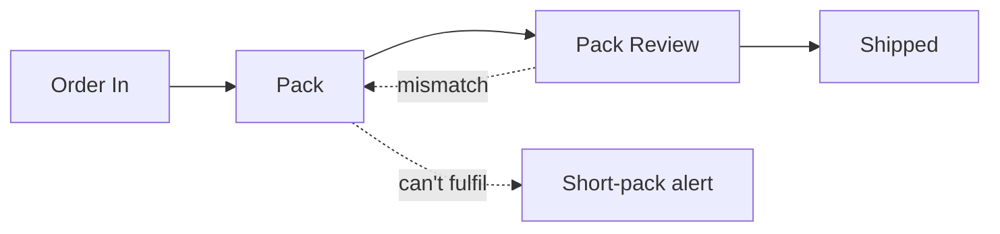
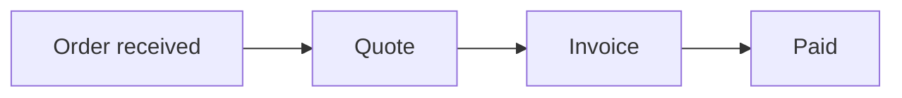
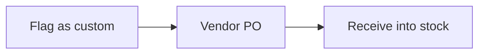

# Workflow Scope in the Business-Analyst Skill — Implementation Plan

> **For agentic workers:** REQUIRED SUB-SKILL: Use superpowers:subagent-driven-development (recommended) or superpowers:executing-plans to implement this plan task-by-task. Steps use checkbox (`- [ ]`) syntax for tracking.

**Goal:** Give the business-analyst skill a `workflow` scope mode: systems → to-be workflows → features in `requirements.json`, and a script-written To-be scope section in `requirements.md`.

**Architecture:** Scope rules live in new Node modules beside the existing validator (`scope-rules`, `scope-checks`, `scope-render`, `scope-md`) and are wired into `checkPackage`. A new CLI `scope.mjs` writes the To-be scope section between markers. Every Node change has a Python twin (`scope_checks.py`, `scope_render.py`, `scope.py`, `validate.py`) kept identical by the parity test. Classic mode output is untouched.

**Tech Stack:** Node ≥ 20 (`node:test`, no dependencies); Python ≥ 3.10 (stdlib only).

**Spec:** `docs/superpowers/specs/2026-10-06-ba-workflow-scope-design.md`

All paths below are relative to `plugins/business-analyst/skills/business-analyst/` unless they start with `plugins/`, `docs/` or `.claude-plugin/`.

## Global Constraints

- `scopeMode` is `"workflow" | "classic"`; absent means `classic`. The existing `mode` field (greenfield / existing) is unrelated and must not change.
- Classic packages: validator findings and md output byte-identical to today.
- To-be scope section: written only by `scope.mjs` / `scope.py`, between `<!-- scope:start -->` and `<!-- scope:end -->`; contains no `SYS-`, `FEAT-`, `WF-` or `FR-` ids.
- Every finding string is identical in Node and Python (parity test compares stderr).
- No dependencies. Node modules: ≤ 200 lines, ≤ 10 functions, ≤ 22 lines per function, ≤ 3 params.
- IDs: `SYS-` and `FEAT-` plus three digits, stable across re-runs.
- Badge text exactly `> ⚠ We drafted this — please confirm`; Start here line exactly as in `scope-md.mjs`.
- Commit messages: Conventional Commits, no AI attribution lines.
- Run tests from the repo root: `node --test plugins/business-analyst/skills/business-analyst/scripts/test/*.test.mjs`; full suite `npm test`.

## Review Focus

1. A `|` inside a feature's text or a system purpose must not break the markdown table — expect it escaped as `\|` (Task 2 test "a pipe inside feature text"; Task 3 parity test).
2. Step names that contain a colon (`Pack: scan vs order`) must resolve and render — `WF-002:Pack: scan vs order` splits on the first colon only (Task 2 test; Task 3 parity test).
3. An agent that moved the markers inside Part 2 by hand must not see them jump back on re-run (Task 2 test "markers moved by hand").
4. QUICK depth has no Part 2 — the section must still land before `## Part 3`, after Part 1 (Task 2 test "a QUICK file").
5. Optional fields absent (`mapLabel`, `replaces`) must render without an empty column or a dangling "Replaces" sentence (Task 2 test "optional fields absent").

## File map

| File | Responsibility | Task |
| --- | --- | --- |
| `scripts/test/fixtures/requirements-workflow-pass.json` / `.md` | Canonical workflow-mode package (trimmed Sin Kowa) | 1 |
| `scripts/lib/scope-rules.mjs` | Pure rule checks on the JSON (flows, steps, FR coverage, names, labels) + shared helpers | 1 |
| `scripts/lib/scope-checks.mjs` | Shape + membership checks, `checkScope` entry point | 1 |
| `scripts/lib/checks.mjs` (modify) | Wire scope checks in; skip to-be workflow ids in the md presence check | 1, 2 |
| `scripts/test/scope-cases.mjs` | One broken variant per rule, shared by Node and parity tests | 1, 2 |
| `scripts/test/scope-checks.test.mjs` | Rule tests | 1 |
| `scripts/lib/scope-render.mjs` | JSON → To-be scope markdown (mermaid, tables) | 2 |
| `scripts/lib/scope-md.mjs` | Insert/replace/remove the section in md; md-side checks | 2 |
| `scripts/scope.mjs` | CLI: refuse a bad scope, else write the section | 2 |
| `scripts/test/scope-md.test.mjs` | Render + md sync tests | 2 |
| `scripts/scope_checks.py`, `scripts/scope_render.py`, `scripts/scope.py` | Python twins | 3 |
| `scripts/validate.py` (modify) | Wire Python scope checks | 3 |
| `scripts/test/python-parity.test.mjs` (modify) | Node ↔ Python agreement on every case and on scope output bytes | 3 |
| `SKILL.md`, `README.md`, `references/interview.md`, `references/writing.md`, `references/review.md` | Docs for the mode | 4 |
| `plugins/business-analyst/.claude-plugin/plugin.json`, `.claude-plugin/marketplace.json` | Version 0.2.0 → 0.3.0 | 4 |

---

### Task 1: Workflow fixture and JSON scope rules (Node)

**Files:**
- Create: `scripts/test/fixtures/requirements-workflow-pass.json`, `scripts/test/fixtures/requirements-workflow-pass.md`
- Create: `scripts/lib/scope-rules.mjs`, `scripts/lib/scope-checks.mjs`
- Create: `scripts/test/scope-cases.mjs`, `scripts/test/scope-checks.test.mjs`
- Modify: `scripts/lib/checks.mjs` (imports; `checkMd` presence loop; `checkPackage`)

**Interfaces:**
- Produces: `scope-rules.mjs` exports `SCOPE_MODES`, `TECH_WORDS`, `modeOf(pkg) → 'workflow'|'classic'|string`, `toBe(pkg) → workflow[]`, `scopeIds(pkg) → string[]`, `checkFlows(pkg)`, `checkFeatureSteps(pkg)`, `checkFeatureFrs(pkg, ids:Set)`, `checkNames(pkg)`, `checkScopeLabels(pkg)` — each returns `string[]` findings.
- Produces: `scope-checks.mjs` exports `checkScope(pkg, ids:Set) → string[]` (shape findings short-circuit; classic returns shape findings only).
- Produces: `test/scope-cases.mjs` exports `loadWorkflow() → {pkg, md}` and `CASES: {name, finding, edit({pkg, md}) → {pkg, md}}[]`.

- [ ] **Step 1: Add the workflow fixtures**

`scripts/test/fixtures/requirements-workflow-pass.json`:

```json
{
  "schemaVersion": "1.0",
  "lead": "sin-kowa-mini",
  "status": "ANALYZED",
  "depth": "STANDARD",
  "updated": "2026-10-06",
  "mode": "greenfield",
  "scopeMode": "workflow",
  "mapLabel": "IMDA roadmap pillar",
  "context": {
    "problem": "Clients dispute charges after the ship sails and there is no record of what was packed.",
    "goals": [
      { "id": "G-001", "goal": "Stop billing disputes after sailing", "metric": "disputes per month down 50% in 6 months", "source": "PO brief" }
    ],
    "successMetrics": ["disputes per month down 50% within 6 months of go-live"]
  },
  "actors": [
    { "id": "ACT-001", "name": "Packer", "type": "human", "goal": "pack an order without paper lists", "painPoints": ["packs from a printed list"] },
    { "id": "ACT-002", "name": "Office staff", "type": "human", "goal": "invoice the moment goods are delivered", "painPoints": ["waits weeks for the paper delivery order"] }
  ],
  "workflows": [
    { "id": "WF-001", "name": "Order to invoice today", "state": "as-is", "trigger": "ship sends an order by email or phone", "steps": ["office staff key the order in", "warehouse packs from a paper list", "paper delivery order signed at the dock", "invoice raised when the paper returns"], "exceptions": ["client disputes a charge after sailing"] },
    { "id": "WF-002", "name": "Order pipeline", "state": "to-be", "label": "confirmed", "source": "PO brief, System 1", "trigger": "order confirmed by office staff", "steps": ["Order In", "Pack", "Pack Review", "Shipped"], "branches": [{ "from": "Pack", "to": "Short-pack alert", "label": "can't fulfil" }, { "from": "Pack Review", "to": "Pack", "label": "mismatch" }], "replaces": ["WF-001"], "exceptions": [] },
    { "id": "WF-003", "name": "Order to cash", "state": "to-be", "label": "recommended", "source": "drafted from PO brief, System 2", "trigger": "order received by email or phone", "steps": ["Order received", "Quote", "Invoice", "Paid"], "branches": [], "replaces": ["WF-001"], "exceptions": [] },
    { "id": "WF-004", "name": "Custom order", "state": "to-be", "label": "confirmed", "source": "PO brief, System 2 sub-flow", "trigger": "order holds an item that is sourced, not stocked", "steps": ["Flag as custom", "Vendor PO", "Receive into stock"], "branches": [], "sub": { "startsAt": "WF-003:Order received", "rejoins": "WF-002", "share": "about 20% of orders" }, "exceptions": [] }
  ],
  "systems": [
    { "id": "SYS-001", "name": "Warehouse operations", "purpose": "Moves an order from intake to the dock; the one screen a warehouse worker needs.", "map": "Warehouse Automation", "label": "confirmed", "source": "PO brief, System 1", "workflows": ["WF-002"], "features": ["FEAT-001", "FEAT-002"] },
    { "id": "SYS-002", "name": "Orders & invoicing", "purpose": "Quotation through to a paid invoice.", "map": "Finance/Documentation", "label": "confirmed", "source": "PO brief, System 2", "workflows": ["WF-003", "WF-004"], "features": ["FEAT-003", "FEAT-004", "FEAT-005"] }
  ],
  "features": [
    { "id": "FEAT-001", "name": "Order pipeline & stage engine", "does": "Moves an order through each stage, with task views per role", "label": "confirmed", "source": "PO brief, System 1", "steps": ["WF-002:Order In", "WF-002:Pack", "WF-002:Pack Review", "WF-002:Shipped"], "requirements": ["FR-001"] },
    { "id": "FEAT-002", "name": "Short-pack alert", "does": "Flags an item that cannot be packed, in time to buy or cancel", "label": "confirmed", "source": "PO brief, System 1", "steps": ["WF-002:Short-pack alert"], "requirements": ["FR-002"] },
    { "id": "FEAT-003", "name": "Order intake & quotation", "does": "Captures email and phone orders and prices them", "label": "confirmed", "source": "PO brief, System 2", "steps": ["WF-003:Order received", "WF-003:Quote", "WF-004:Flag as custom"], "requirements": ["FR-003"] },
    { "id": "FEAT-004", "name": "Invoice from packed quantities", "does": "Raises the invoice from what was packed and shipped", "label": "recommended", "source": "drafted from PO brief, System 2", "steps": ["WF-002:Shipped", "WF-003:Invoice", "WF-003:Paid"], "requirements": ["FR-004"] },
    { "id": "FEAT-005", "name": "One login, role-based screens", "does": "One login; packers see packing tasks, office staff see orders and invoices", "label": "confirmed", "source": "PO brief, System 1", "steps": ["*"], "requirements": ["FR-005"] }
  ],
  "requirements": [
    { "id": "FR-001", "text": "The system must move each order through the stages Order In, Pack, Pack Review and Shipped.", "label": "confirmed", "source": "PO brief, System 1", "traces": { "goal": "G-001", "workflow": "WF-002", "rules": [] }, "scope": "in", "acceptance": [] },
    { "id": "FR-002", "text": "The system must let a packer flag an item that cannot be packed and alert office staff.", "label": "confirmed", "source": "PO brief, System 1", "traces": { "goal": "G-001", "workflow": "WF-002", "rules": [] }, "scope": "in", "acceptance": [] },
    { "id": "FR-003", "text": "Office staff must be able to enter an order received by email or phone and produce a quotation.", "label": "confirmed", "source": "PO brief, System 2", "traces": { "goal": "G-001", "workflow": "WF-003", "rules": [] }, "scope": "in", "acceptance": [] },
    { "id": "FR-004", "text": "The system must raise the invoice from packed-and-audited quantities.", "label": "assumed", "source": "PO brief, System 2", "traces": { "goal": "G-001", "workflow": "WF-003", "rules": ["BR-001"] }, "scope": "in", "acceptance": ["SC-001"] },
    { "id": "FR-005", "text": "The system must provide one login, with packers limited to packing tasks.", "label": "confirmed", "source": "PO brief, System 1", "traces": { "goal": "G-001", "workflow": "WF-002", "rules": [] }, "scope": "in", "acceptance": [] },
    { "id": "FR-006", "text": "The system must print a pallet label at the Pack stage.", "label": "assumed", "source": "PO brief, System 4", "traces": { "goal": "G-001", "workflow": "WF-002", "rules": [] }, "scope": "future", "acceptance": [] }
  ],
  "businessRules": [
    { "id": "BR-001", "rule": "Invoice quantity equals packed-and-audited quantity.", "source": "PO brief, System 2", "examples": ["ordered 10, packed 10 -> invoice 10", "ordered 10, packed 8 -> invoice 8"] }
  ],
  "scenarios": [
    { "id": "SC-001", "requirement": "FR-004", "type": "happy", "given": "an order of 10 items with 8 packed", "when": "the invoice is raised", "then": "it bills 8 items" }
  ],
  "nfrs": [
    { "id": "NFR-001", "area": "availability", "text": "Scans made without connectivity must be kept and synced within 5 minutes of reconnecting.", "label": "assumed" }
  ],
  "integrations": [
    { "id": "INT-001", "system": "InvoiceNow network", "direction": "write", "label": "recommended" }
  ],
  "data": [
    { "id": "DAT-001", "entity": "Order", "sensitivity": "commercial", "volume": "about 300 per month", "label": "assumed" }
  ],
  "constraints": [
    { "id": "CON-001", "text": "Vessels are offline at sea; delivery orders are signed on paper at the dock today.", "source": "PO brief" }
  ],
  "assumptions": [
    { "id": "ASM-001", "text": "Packers carry a phone with a camera on the warehouse floor.", "impact": "medium", "status": "unconfirmed" }
  ],
  "openQuestions": [
    { "id": "Q-001", "question": "Is order to cash the right shape: quote before the order is confirmed?", "priority": "P1", "reason": "the workflow was drafted, not described by the client", "affects": ["WF-003"], "status": "open", "answer": null, "architectureBlocker": false },
    { "id": "Q-002", "question": "Should the invoice be raised at shipping, or when the delivery order is signed?", "priority": "P2", "reason": "decides the invoice trigger", "affects": ["FEAT-004", "INT-001"], "status": "open", "answer": null, "architectureBlocker": false }
  ],
  "conflicts": [],
  "scope": { "out": ["last-mile delivery tracking"], "future": ["pallet labels"], "unconfirmed": [] },
  "ai": null,
  "readiness": {
    "overall": 63,
    "areas": { "businessContext": 80, "workflows": 70, "rules": 60, "integrations": 50, "data": 60, "nfrs": 60 },
    "blockers": []
  }
}
```

`scripts/test/fixtures/requirements-workflow-pass.md` (the To-be scope section is the exact output Task 2's script produces — keep it byte for byte):

````markdown
---
lead: sin-kowa-mini
status: ANALYZED
depth: STANDARD
scopeMode: workflow
updated: 2026-10-06
readiness: 63
---

# Requirements — Sin Kowa (mini)

> **Product owner? Start here:** [To-be scope](#to-be-scope) shows the systems, workflows and features we propose to build. Items marked ⚠ are our draft; tell us in chat what to change.

Source: PO brief, trimmed to two systems for tests.

## Part 1 — Discovery Brief

Problem: clients dispute charges after the ship sails and there is no record of what was packed.

| ID | Goal | Metric |
| --- | --- | --- |
| G-001 | Stop billing disputes after sailing | disputes per month down 50% in 6 months |

Constraints: CON-001 — vessels are offline at sea; delivery orders are signed on paper today.

## Part 2 — Process & Domain

As-is workflow WF-001 (order to invoice today): office staff (ACT-002) key the order in →
the packer (ACT-001) packs from a paper list → paper delivery order signed at the dock →
invoice raised when the paper returns.

| ID | Rule | Examples |
| --- | --- | --- |
| BR-001 | Invoice quantity equals packed-and-audited quantity | ordered 10, packed 8 → invoice 8 |

<!-- scope:start -->

### To-be scope

What we propose to build: 2 systems, each shown as its workflows and then the features that serve them.

| System | Purpose | IMDA roadmap pillar |
| --- | --- | --- |
| Warehouse operations | Moves an order from intake to the dock; the one screen a warehouse worker needs. | Warehouse Automation |
| Orders & invoicing | Quotation through to a paid invoice. | Finance/Documentation |

### Warehouse operations

Moves an order from intake to the dock; the one screen a warehouse worker needs. Replaces today's "Order to invoice today".

**Main workflow: Order pipeline**



| Feature | What it does | Where in the workflow |
| --- | --- | --- |
| Order pipeline & stage engine | Moves an order through each stage, with task views per role | Order In → Pack → Pack Review → Shipped |
| Short-pack alert | Flags an item that cannot be packed, in time to buy or cancel | Short-pack alert |

### Orders & invoicing

Quotation through to a paid invoice. Replaces today's "Order to invoice today".

**Main workflow: Order to cash**

> ⚠ We drafted this — please confirm



**Sub-workflow: Custom order** — starts at Order received, rejoins Order pipeline · about 20% of orders



| Feature | What it does | Where in the workflow |
| --- | --- | --- |
| Order intake & quotation | Captures email and phone orders and prices them | Order received → Quote; Flag as custom |
| Invoice from packed quantities ⚠ | Raises the invoice from what was packed and shipped | Shipped (in Order pipeline); Invoice → Paid |
| One login, role-based screens | One login; packers see packing tasks, office staff see orders and invoices | every step |

<!-- scope:end -->

## Part 3 — Requirements

Scope — out: last-mile delivery tracking. Future: pallet labels.

| ID | Requirement | Label | Scope | Feature |
| --- | --- | --- | --- | --- |
| FR-001 | Move each order through Order In, Pack, Pack Review, Shipped | confirmed | in | Order pipeline & stage engine |
| FR-002 | Packer flags an item that cannot be packed; office alerted | confirmed | in | Short-pack alert |
| FR-003 | Enter an email or phone order and produce a quotation | confirmed | in | Order intake & quotation |
| FR-004 | Raise the invoice from packed-and-audited quantities | assumed | in | Invoice from packed quantities |
| FR-005 | One login; packers limited to packing tasks | confirmed | in | One login, role-based screens |
| FR-006 | Print a pallet label at Pack | assumed | future | — |

NFR-001 (availability, assumed): offline scans synced within 5 minutes of reconnecting.
INT-001: write invoices to the InvoiceNow network (recommended).
DAT-001: Order — commercial, about 300 per month (assumed).

## Part 4 — Acceptance Scenarios

| ID | Given | When | Then |
| --- | --- | --- | --- |
| SC-001 | an order of 10 items with 8 packed | the invoice is raised | it bills 8 items |

## Part 5 — Readiness Report

Readiness: 63%. Areas — businessContext 80, workflows 70, rules 60,
integrations 50, data 60, nfrs 60.

Open questions: Q-001 (P1) — is order to cash the right shape? Q-002 (P2) — invoice at
shipping or at the signed delivery order?
Assumptions: ASM-001 (medium impact, unconfirmed) — packers carry a camera phone.
Blockers: none. Conflicts: none.
````

- [ ] **Step 2: Write the failing tests**

`scripts/test/scope-cases.mjs`:

```js
// One broken variant of the workflow pass fixture per scope rule (spec §5).
// Shared by scope-checks.test.mjs and python-parity.test.mjs.
import { readFileSync } from 'node:fs';

const fx = (f) => readFileSync(new URL(`./fixtures/${f}`, import.meta.url), 'utf8');
export const loadWorkflow = () => ({
  pkg: JSON.parse(fx('requirements-workflow-pass.json')),
  md: fx('requirements-workflow-pass.md'),
});

const pkgCase = (name, finding, edit) => ({ name, finding, edit: (c) => { edit(c.pkg); return c; } });

export const CASES = [
  pkgCase('illegal scopeMode', 'scopeMode must be workflow|classic', (p) => { p.scopeMode = 'list'; }),
  pkgCase('workflow without systems', 'scopeMode workflow needs systems and features', (p) => { delete p.systems; }),
  pkgCase('classic with systems', 'systems/features only in workflow mode', (p) => { p.scopeMode = 'classic'; }),
  pkgCase('bad feature id', 'features: bad id F-1', (p) => { p.features[0].id = 'F-1'; }),
  pkgCase('system without workflow', 'SYS-002: needs a to-be workflow', (p) => { p.systems[1].workflows = []; }),
  pkgCase('system lists an as-is workflow', 'SYS-001: workflow WF-001 is not a to-be workflow', (p) => { p.systems[0].workflows.push('WF-001'); }),
  pkgCase('workflow in two systems', 'WF-002: belongs to SYS-001 and SYS-002', (p) => { p.systems[1].workflows.push('WF-002'); }),
  pkgCase('feature in no system', 'FEAT-002: listed by no system', (p) => { p.systems[0].features.pop(); }),
  pkgCase('unknown feature step', 'FEAT-002: unknown step WF-002:Short-pack', (p) => { p.features[1].steps = ['WF-002:Short-pack']; }),
  pkgCase('feature without steps', 'FEAT-001: needs at least one step', (p) => { p.features[0].steps = []; }),
  pkgCase('branch from unknown step', 'WF-002: branch from unknown step Packing', (p) => { p.workflows[1].branches[0].from = 'Packing'; }),
  pkgCase('sub starts nowhere', 'WF-004: sub.startsAt unknown', (p) => { p.workflows[3].sub.startsAt = 'WF-003:Intake'; }),
  pkgCase('sub rejoins as-is', 'WF-004: sub.rejoins is not a to-be workflow', (p) => { p.workflows[3].sub.rejoins = 'WF-001'; }),
  pkgCase('replaces unknown', 'WF-002: replaces unknown as-is workflow WF-009', (p) => { p.workflows[1].replaces = ['WF-009']; }),
  pkgCase('in-scope FR in no feature', 'FR-003: in scope but in no feature', (p) => { p.features[2].requirements = []; }),
  pkgCase('feature cites missing FR', 'FEAT-003: dangling reference FR-099', (p) => { p.features[2].requirements = ['FR-003', 'FR-099']; }),
  pkgCase('duplicate feature name', 'duplicate feature name: Order intake & quotation', (p) => { p.features[1].name = 'order intake & quotation'; }),
  pkgCase('tech word in name', 'FEAT-001: name uses a tech word (API)', (p) => { p.features[0].name = 'Order APIs'; }),
  pkgCase('system without source', 'SYS-001: missing source', (p) => { delete p.systems[0].source; }),
  pkgCase('illegal feature label', 'FEAT-001: illegal label "maybe"', (p) => { p.features[0].label = 'maybe'; }),
  pkgCase('recommended without question', 'FEAT-004: recommended without a paired open question', (p) => { p.openQuestions[1].affects = ['INT-001']; }),
];
```

`scripts/test/scope-checks.test.mjs`:

```js
import { test } from 'node:test';
import assert from 'node:assert/strict';
import { checkPackage } from '../lib/checks.mjs';
import { CASES, loadWorkflow } from './scope-cases.mjs';

test('the workflow pass pair has no findings', () => {
  const { pkg, md } = loadWorkflow();
  assert.deepEqual(checkPackage({ pkg, md }), []);
});

test('a classic package without scope fields is untouched', () => {
  const { pkg, md } = loadWorkflow();
  for (const k of ['systems', 'features', 'scopeMode', 'mapLabel']) delete pkg[k];
  const plain = md.replace(/<!-- scope:start -->[\s\S]*?<!-- scope:end -->\n*/, '').replace('scopeMode: workflow\n', '');
  const findings = checkPackage({ pkg, md: plain });
  assert.ok(findings.some((f) => f.includes('WF-002') && f.includes('absent')), 'classic still requires to-be workflow ids in md');
  assert.ok(!findings.some((f) => f.includes('scope')));
});

for (const c of CASES) {
  test(`scope rule: ${c.name}`, () => {
    const { pkg, md } = c.edit(loadWorkflow());
    const findings = checkPackage({ pkg, md });
    assert.ok(findings.includes(c.finding), `expected "${c.finding}" in:\n${findings.join('\n')}`);
  });
}
```

- [ ] **Step 3: Run them to verify they fail**

Run: `node --test plugins/business-analyst/skills/business-analyst/scripts/test/scope-checks.test.mjs`
Expected: 22 FAIL, 1 pass. "a classic package without scope fields is untouched" already passes — it guards today's behaviour. "the workflow pass pair has no findings" lists `md: id WF-002 absent from requirements.md` (and WF-003, WF-004); every `scope rule:` test fails with `expected "<finding>" in:`.

- [ ] **Step 4: Write `scripts/lib/scope-rules.mjs`**

```js
import { LABELS } from './schema.mjs';

export const SCOPE_MODES = ['workflow', 'classic'];
export const TECH_WORDS = ['API', 'database', 'microservice', 'backend', 'frontend', 'server', 'endpoint', 'schema', 'PWA', 'cloud'];

export const modeOf = (pkg) => pkg.scopeMode ?? 'classic';
export const toBe = (pkg) => (pkg.workflows ?? []).filter((w) => w.state === 'to-be');
export const scopeIds = (pkg) => [...(pkg.systems ?? []), ...(pkg.features ?? [])].map((r) => r.id);

function stepIndex(pkg) {
  const idx = new Set();
  for (const w of toBe(pkg)) {
    for (const s of w.steps ?? []) idx.add(`${w.id}:${s}`);
    for (const b of w.branches ?? []) idx.add(`${w.id}:${b.to}`);
  }
  return idx;
}

export function checkFlows(pkg) {
  const findings = [];
  const idx = stepIndex(pkg);
  const flows = toBe(pkg).map((w) => w.id);
  const asIs = (pkg.workflows ?? []).filter((w) => w.state === 'as-is').map((w) => w.id);
  for (const w of toBe(pkg)) {
    for (const b of w.branches ?? []) {
      if (!idx.has(`${w.id}:${b.from}`)) findings.push(`${w.id}: branch from unknown step ${b.from}`);
    }
    if (w.sub && !idx.has(w.sub.startsAt)) findings.push(`${w.id}: sub.startsAt unknown`);
    if (w.sub && !flows.includes(w.sub.rejoins)) findings.push(`${w.id}: sub.rejoins is not a to-be workflow`);
    for (const r of w.replaces ?? []) if (!asIs.includes(r)) findings.push(`${w.id}: replaces unknown as-is workflow ${r}`);
  }
  return findings;
}

export function checkFeatureSteps(pkg) {
  const findings = [];
  const idx = stepIndex(pkg);
  for (const f of pkg.features) {
    const steps = f.steps ?? [];
    if (steps.length === 1 && steps[0] === '*') continue;
    if (!steps.length) findings.push(`${f.id}: needs at least one step`);
    for (const s of steps) if (!idx.has(s)) findings.push(`${f.id}: unknown step ${s}`);
  }
  return findings;
}

export function checkFeatureFrs(pkg, ids) {
  const findings = [];
  const covered = new Set();
  for (const f of pkg.features) {
    for (const fr of f.requirements ?? []) {
      covered.add(fr);
      if (!ids.has(fr)) findings.push(`${f.id}: dangling reference ${fr}`);
    }
  }
  for (const fr of pkg.requirements ?? []) {
    if (fr.scope === 'in' && !covered.has(fr.id)) findings.push(`${fr.id}: in scope but in no feature`);
  }
  return findings;
}

const techWord = (name) => TECH_WORDS.find((w) => new RegExp(`\\b${w}s?\\b`, 'i').test(name ?? ''));

export function checkNames(pkg) {
  const findings = [];
  for (const [kind, rows] of [['system', pkg.systems], ['feature', pkg.features]]) {
    const seen = new Set();
    for (const r of rows) {
      const key = (r.name ?? '').toLowerCase();
      if (seen.has(key)) findings.push(`duplicate ${kind} name: ${r.name}`);
      seen.add(key);
      const word = techWord(r.name);
      if (word) findings.push(`${r.id}: name uses a tech word (${word})`);
    }
  }
  return findings;
}

export function checkScopeLabels(pkg) {
  const findings = [];
  const asked = new Set((pkg.openQuestions ?? []).flatMap((q) => q.affects ?? []));
  for (const r of [...toBe(pkg), ...pkg.systems, ...pkg.features]) {
    if (!r.label) findings.push(`${r.id}: missing label`);
    else if (!LABELS.includes(r.label)) findings.push(`${r.id}: illegal label "${r.label}"`);
    if (!r.source) findings.push(`${r.id}: missing source`);
    if (r.label === 'recommended' && !asked.has(r.id)) {
      findings.push(`${r.id}: recommended without a paired open question`);
    }
  }
  return findings;
}
```

- [ ] **Step 5: Write `scripts/lib/scope-checks.mjs`**

```js
import {
  SCOPE_MODES, modeOf, toBe, scopeIds,
  checkFlows, checkFeatureSteps, checkFeatureFrs, checkNames, checkScopeLabels,
} from './scope-rules.mjs';

const ID_RES = [['systems', /^SYS-\d{3}$/], ['features', /^FEAT-\d{3}$/]];

function checkShape(pkg) {
  if (!SCOPE_MODES.includes(modeOf(pkg))) return ['scopeMode must be workflow|classic'];
  if (modeOf(pkg) === 'classic') {
    return 'systems' in pkg || 'features' in pkg ? ['systems/features only in workflow mode'] : [];
  }
  if (!pkg.systems?.length || !pkg.features?.length) return ['scopeMode workflow needs systems and features'];
  const findings = [];
  for (const [k, re] of ID_RES) {
    for (const r of pkg[k]) if (!re.test(r.id ?? '')) findings.push(`${k}: bad id ${r.id}`);
  }
  const seen = new Set();
  for (const id of scopeIds(pkg)) {
    if (seen.has(id)) findings.push(`duplicate id: ${id}`);
    seen.add(id);
  }
  return findings;
}

function owners(systems, key) {
  const map = new Map();
  for (const s of systems) for (const id of s[key] ?? []) map.set(id, [...(map.get(id) ?? []), s.id]);
  return map;
}

function ownership(ids, own, verb) {
  return ids.flatMap((id) => {
    const by = own.get(id) ?? [];
    if (by.length === 1) return [];
    return [by.length ? `${id}: ${verb} ${by.join(' and ')}` : `${id}: ${verb} no system`];
  });
}

function checkMembership(pkg) {
  const findings = [];
  const flows = toBe(pkg).map((w) => w.id);
  const feats = pkg.features.map((f) => f.id);
  for (const s of pkg.systems) {
    if (!(s.workflows ?? []).length) findings.push(`${s.id}: needs a to-be workflow`);
    for (const w of s.workflows ?? []) if (!flows.includes(w)) findings.push(`${s.id}: workflow ${w} is not a to-be workflow`);
    for (const f of s.features ?? []) if (!feats.includes(f)) findings.push(`${s.id}: dangling reference ${f}`);
  }
  return [
    ...findings,
    ...ownership(flows, owners(pkg.systems, 'workflows'), 'belongs to'),
    ...ownership(feats, owners(pkg.systems, 'features'), 'listed by'),
  ];
}

export function checkScope(pkg, ids) {
  const shape = checkShape(pkg);
  if (shape.length || modeOf(pkg) === 'classic') return shape;
  return [
    ...checkMembership(pkg),
    ...checkFlows(pkg),
    ...checkFeatureSteps(pkg),
    ...checkFeatureFrs(pkg, ids),
    ...checkNames(pkg),
    ...checkScopeLabels(pkg),
  ];
}
```

- [ ] **Step 6: Wire into `scripts/lib/checks.mjs`**

Replace the first line:

```js
import { REGISTERS, STATUSES, AREAS, checkSchema } from './schema.mjs';
```

with:

```js
import { REGISTERS, STATUSES, AREAS, checkSchema } from './schema.mjs';
import { modeOf, toBe, scopeIds } from './scope-rules.mjs';
import { checkScope } from './scope-checks.mjs';
```

In `checkMd`, replace:

```js
  const mdIds = new Set([...md.matchAll(ID_TOKEN)].map((m) => m[0]));
  for (const id of collectIds(pkg)) {
    if (!mdIds.has(id)) findings.push(`md: id ${id} absent from requirements.md`);
```

with:

```js
  const mdIds = new Set([...md.matchAll(ID_TOKEN)].map((m) => m[0]));
  const named = new Set(modeOf(pkg) === 'workflow' ? toBe(pkg).map((w) => w.id) : []);
  for (const id of collectIds(pkg)) {
    if (!named.has(id) && !mdIds.has(id)) findings.push(`md: id ${id} absent from requirements.md`);
```

In `checkPackage`, replace:

```js
  const ids = collectIds(pkg);
  return [
```

with:

```js
  const ids = new Set([...collectIds(pkg), ...scopeIds(pkg)]);
  const scope = checkScope(pkg, ids);
  return [
```

and replace:

```js
    ...checkMdOrphanIds(pkg, md, ids),
  ];
```

with:

```js
    ...checkMdOrphanIds(pkg, md, ids),
    ...scope,
  ];
```

- [ ] **Step 7: Run the tests to verify they pass**

Run: `node --test plugins/business-analyst/skills/business-analyst/scripts/test/*.test.mjs`
Expected: PASS — all existing tests plus 23 new (`the workflow pass pair…`, `a classic package…`, 21 `scope rule:` cases). The Python parity tests still pass: no Python file changed and no parity case uses the workflow fixture yet.

- [ ] **Step 8: Commit**

```bash
/usr/bin/git add plugins/business-analyst/skills/business-analyst/scripts/lib/scope-rules.mjs plugins/business-analyst/skills/business-analyst/scripts/lib/scope-checks.mjs plugins/business-analyst/skills/business-analyst/scripts/lib/checks.mjs plugins/business-analyst/skills/business-analyst/scripts/test/scope-cases.mjs plugins/business-analyst/skills/business-analyst/scripts/test/scope-checks.test.mjs plugins/business-analyst/skills/business-analyst/scripts/test/fixtures/requirements-workflow-pass.json plugins/business-analyst/skills/business-analyst/scripts/test/fixtures/requirements-workflow-pass.md
/usr/bin/git commit -m "feat(business-analyst): validate workflow scope in requirements.json"
```

---

### Task 2: Render the To-be scope and the `scope.mjs` CLI (Node)

**Files:**
- Create: `scripts/lib/scope-render.mjs`, `scripts/lib/scope-md.mjs`, `scripts/scope.mjs`, `scripts/test/scope-md.test.mjs`
- Modify: `scripts/test/scope-cases.mjs` (add md cases), `scripts/lib/checks.mjs` (md checks)

**Interfaces:**
- Consumes: `modeOf`, `toBe`, `scopeIds` (scope-rules); `checkScope` (scope-checks); `collectIds`, `checkPackage` (checks).
- Produces: `scope-render.mjs` exports `START`, `END`, `BADGE`, `mermaid(workflow) → string`, `renderScope(pkg) → string` (starts with `START`, ends with `END`, sections joined by blank lines).
- Produces: `scope-md.mjs` exports `START_HERE`, `applyScope(md, pkg) → md`, `checkScopeMd(pkg, md) → string[]`.
- Produces: CLI `node scripts/scope.mjs --json <path> --md <path>` — exit 1 with findings on stderr and the md untouched when `checkScope` fails; else writes the md and prints `scope written (<mode>)`.

- [ ] **Step 1: Add the md cases**

Replace `scripts/test/scope-cases.mjs` with:

```js
// One broken variant of the workflow pass fixture per scope rule (spec §5).
// Shared by scope-checks.test.mjs and python-parity.test.mjs.
import { readFileSync } from 'node:fs';

const fx = (f) => readFileSync(new URL(`./fixtures/${f}`, import.meta.url), 'utf8');
export const loadWorkflow = () => ({
  pkg: JSON.parse(fx('requirements-workflow-pass.json')),
  md: fx('requirements-workflow-pass.md'),
});

const toClassic = (pkg) => {
  for (const k of ['systems', 'features', 'scopeMode', 'mapLabel']) delete pkg[k];
};
const pkgCase = (name, finding, edit) => ({ name, finding, edit: (c) => { edit(c.pkg); return c; } });
const mdCase = (name, finding, edit) => ({ name, finding, edit: (c) => ({ ...c, md: edit(c.md) }) });

export const CASES = [
  pkgCase('illegal scopeMode', 'scopeMode must be workflow|classic', (p) => { p.scopeMode = 'list'; }),
  pkgCase('workflow without systems', 'scopeMode workflow needs systems and features', (p) => { delete p.systems; }),
  pkgCase('classic with systems', 'systems/features only in workflow mode', (p) => { p.scopeMode = 'classic'; }),
  pkgCase('bad feature id', 'features: bad id F-1', (p) => { p.features[0].id = 'F-1'; }),
  pkgCase('system without workflow', 'SYS-002: needs a to-be workflow', (p) => { p.systems[1].workflows = []; }),
  pkgCase('system lists an as-is workflow', 'SYS-001: workflow WF-001 is not a to-be workflow', (p) => { p.systems[0].workflows.push('WF-001'); }),
  pkgCase('workflow in two systems', 'WF-002: belongs to SYS-001 and SYS-002', (p) => { p.systems[1].workflows.push('WF-002'); }),
  pkgCase('feature in no system', 'FEAT-002: listed by no system', (p) => { p.systems[0].features.pop(); }),
  pkgCase('unknown feature step', 'FEAT-002: unknown step WF-002:Short-pack', (p) => { p.features[1].steps = ['WF-002:Short-pack']; }),
  pkgCase('feature without steps', 'FEAT-001: needs at least one step', (p) => { p.features[0].steps = []; }),
  pkgCase('branch from unknown step', 'WF-002: branch from unknown step Packing', (p) => { p.workflows[1].branches[0].from = 'Packing'; }),
  pkgCase('sub starts nowhere', 'WF-004: sub.startsAt unknown', (p) => { p.workflows[3].sub.startsAt = 'WF-003:Intake'; }),
  pkgCase('sub rejoins as-is', 'WF-004: sub.rejoins is not a to-be workflow', (p) => { p.workflows[3].sub.rejoins = 'WF-001'; }),
  pkgCase('replaces unknown', 'WF-002: replaces unknown as-is workflow WF-009', (p) => { p.workflows[1].replaces = ['WF-009']; }),
  pkgCase('in-scope FR in no feature', 'FR-003: in scope but in no feature', (p) => { p.features[2].requirements = []; }),
  pkgCase('feature cites missing FR', 'FEAT-003: dangling reference FR-099', (p) => { p.features[2].requirements = ['FR-003', 'FR-099']; }),
  pkgCase('duplicate feature name', 'duplicate feature name: Order intake & quotation', (p) => { p.features[1].name = 'order intake & quotation'; }),
  pkgCase('tech word in name', 'FEAT-001: name uses a tech word (API)', (p) => { p.features[0].name = 'Order APIs'; }),
  pkgCase('system without source', 'SYS-001: missing source', (p) => { delete p.systems[0].source; }),
  pkgCase('illegal feature label', 'FEAT-001: illegal label "maybe"', (p) => { p.features[0].label = 'maybe'; }),
  pkgCase('recommended without question', 'FEAT-004: recommended without a paired open question', (p) => { p.openQuestions[1].affects = ['INT-001']; }),
  mdCase('frontmatter mode missing', 'md: scopeMode does not match json', (md) => md.replace('scopeMode: workflow\n', '')),
  mdCase('hand-edited scope', 'md: To-be scope is stale — run scope', (md) => md.replace('n3["Paid"]', 'n3["Settled"]')),
  { name: 'classic with scope section', finding: 'md: To-be scope only in workflow mode', edit: (c) => { toClassic(c.pkg); return c; } },
  mdCase('wrong Feature cell', 'md: FR-002 Feature column says Pack alert, json says Short-pack alert', (md) => md.replace('| in | Short-pack alert |', '| in | Pack alert |')),
  mdCase('no Feature column', 'md: FR table has no Feature column', (md) => md.replace('| Label | Scope | Feature |', '| Label | Scope |')),
];
```

- [ ] **Step 2: Write the failing render tests**

`scripts/test/scope-md.test.mjs`:

````js
import { test } from 'node:test';
import assert from 'node:assert/strict';
import { execFileSync } from 'node:child_process';
import { mkdtempSync, readFileSync, writeFileSync } from 'node:fs';
import { tmpdir } from 'node:os';
import { join } from 'node:path';
import { fileURLToPath } from 'node:url';
import { applyScope, START_HERE } from '../lib/scope-md.mjs';
import { mermaid } from '../lib/scope-render.mjs';
import { checkPackage } from '../lib/checks.mjs';
import { loadWorkflow } from './scope-cases.mjs';

const script = fileURLToPath(new URL('../scope.mjs', import.meta.url));
const BLOCK = /<!-- scope:start -->[\s\S]*?<!-- scope:end -->\n*/;
const strip = (md) => md.replace(BLOCK, '').replace(`\n${START_HERE}\n`, '');

test('applyScope rebuilds the fixture from a file without the section', () => {
  const { pkg, md } = loadWorkflow();
  assert.equal(applyScope(strip(md), pkg), md);
});

test('applyScope is idempotent', () => {
  const { pkg, md } = loadWorkflow();
  assert.equal(applyScope(md, pkg), md);
});

test('classic mode removes the section and the Start here line', () => {
  const { pkg, md } = loadWorkflow();
  pkg.scopeMode = 'classic';
  const out = applyScope(md, pkg);
  assert.equal(out, strip(md));
});

test('the section names things, never ids', () => {
  const { md } = loadWorkflow();
  const section = md.match(BLOCK)[0];
  assert.doesNotMatch(section, /\b(?:SYS|FEAT|WF|FR)-\d{3}\b/);
});

test('a drafted workflow and a drafted feature carry the badge', () => {
  const section = loadWorkflow().md.match(BLOCK)[0];
  assert.match(section, /\*\*Main workflow: Order to cash\*\*\n\n> ⚠ We drafted this — please confirm/);
  assert.match(section, /\| Invoice from packed quantities ⚠ \|/);
  assert.match(section, /Shipped \(in Order pipeline\); Invoice → Paid/);
});

test('mermaid: loops back to an existing step and side exits to a new one', () => {
  const out = mermaid({ steps: ['A', 'B'], branches: [{ from: 'B', to: 'A', label: 'retry' }, { from: 'A', to: 'C' }] });
  assert.equal(out, '```mermaid\nflowchart LR\n  n0 --> n1\n  n1 -.->|retry| n0\n  n0 -.-> n2\n  n0["A"]\n  n1["B"]\n  n2["C"]\n```');
});

test('scope.mjs refuses a broken scope and leaves the md alone', () => {
  const dir = mkdtempSync(join(tmpdir(), 'ba-scope-'));
  const { pkg, md } = loadWorkflow();
  pkg.features[1].steps = ['WF-002:Nowhere'];
  writeFileSync(join(dir, 'r.json'), JSON.stringify(pkg));
  writeFileSync(join(dir, 'r.md'), 'untouched');
  assert.throws(() => execFileSync('node', [script, '--json', join(dir, 'r.json'), '--md', join(dir, 'r.md')], { stdio: 'pipe' }));
  assert.equal(readFileSync(join(dir, 'r.md'), 'utf8'), 'untouched');
  assert.ok(md.length > 0);
});

test('a pipe inside feature text is escaped so the table holds', () => {
  const { pkg, md } = loadWorkflow();
  pkg.features[0].does = 'Moves an order | shows each stage';
  const out = applyScope(md, pkg);
  assert.match(out, /\| Order pipeline & stage engine \| Moves an order \\\| shows each stage \|/);
});

test('a step name with a colon resolves and renders', () => {
  const { pkg, md } = loadWorkflow();
  pkg.workflows[1].steps[1] = 'Pack: scan vs order';
  pkg.workflows[1].branches = [{ from: 'Pack: scan vs order', to: 'Short-pack alert' }];
  pkg.features[0].steps[1] = 'WF-002:Pack: scan vs order';
  assert.deepEqual(checkPackage({ pkg, md: applyScope(md, pkg) }), []);
  assert.match(applyScope(md, pkg), /Order In → Pack: scan vs order → Pack Review/);
});

test('markers moved by hand stay where they are on re-run', () => {
  const { pkg, md } = loadWorkflow();
  const section = md.match(BLOCK)[0];
  const moved = md.replace(section, '').replace('## Part 2 — Process & Domain\n\n', `## Part 2 — Process & Domain\n\n${section}`);
  assert.equal(applyScope(moved, pkg), moved);
});

test('a QUICK file (no Part 2) gets the section before Part 3', () => {
  const { pkg, md } = loadWorkflow();
  const quick = strip(md).replace(/## Part 2[\s\S]*?(?=## Part 3)/, '');
  const out = applyScope(quick, pkg);
  assert.ok(out.indexOf('<!-- scope:end -->') < out.indexOf('## Part 3'));
  assert.ok(out.indexOf('## Part 1') < out.indexOf('<!-- scope:start -->'));
});

test('optional fields absent: no map column, no Replaces line', () => {
  const { pkg, md } = loadWorkflow();
  delete pkg.mapLabel;
  for (const w of pkg.workflows) delete w.replaces;
  const section = applyScope(md, pkg).match(BLOCK)[0];
  assert.match(section, /\| System \| Purpose \|\n\| --- \| --- \|\n/);
  assert.doesNotMatch(section, /Replaces today's/);
});
````

- [ ] **Step 3: Run them to verify they fail**

Run: `node --test plugins/business-analyst/skills/business-analyst/scripts/test/scope-md.test.mjs plugins/business-analyst/skills/business-analyst/scripts/test/scope-checks.test.mjs`
Expected: FAIL — `scope-md.test.mjs` cannot import `../lib/scope-md.mjs` (ERR_MODULE_NOT_FOUND); the five md `scope rule:` cases fail with `expected "md: …" in:`.

- [ ] **Step 4: Write `scripts/lib/scope-render.mjs`**

````js
export const START = '<!-- scope:start -->';
export const END = '<!-- scope:end -->';
export const BADGE = '> ⚠ We drafted this — please confirm';

const drafted = (r) => r.label !== 'confirmed';
const stepOf = (ref) => ref.slice(ref.indexOf(':') + 1);
const cell = (text) => String(text).replaceAll('|', '\\|');

export function mermaid(w) {
  const ids = new Map();
  const nid = (n) => {
    if (!ids.has(n)) ids.set(n, `n${ids.size}`);
    return ids.get(n);
  };
  const steps = w.steps ?? [];
  steps.forEach(nid);
  const lines = ['flowchart LR'];
  steps.slice(1).forEach((s, i) => lines.push(`  ${nid(steps[i])} --> ${nid(s)}`));
  for (const b of w.branches ?? []) lines.push(`  ${nid(b.from)} -.->${b.label ? `|${b.label}|` : ''} ${nid(b.to)}`);
  for (const [n, id] of ids) lines.push(`  ${id}["${n.replaceAll('"', "'")}"]`);
  return ['```mermaid', ...lines, '```'].join('\n');
}

function whereCell(f, sys, flows) {
  const refs = f.steps ?? [];
  if (refs.length === 1 && refs[0] === '*') return 'every step';
  const groups = new Map();
  for (const r of refs) {
    const wid = r.slice(0, r.indexOf(':'));
    groups.set(wid, [...(groups.get(wid) ?? []), stepOf(r)]);
  }
  return [...groups]
    .map(([wid, st]) => st.join(' → ') + (sys.workflows.includes(wid) ? '' : ` (in ${flows.get(wid).name})`))
    .join('; ');
}

function workflowBlock(w, main, flows) {
  let head = `**${main ? 'Main workflow' : 'Sub-workflow'}: ${w.name}**`;
  if (w.sub) {
    head += ` — starts at ${stepOf(w.sub.startsAt)}, rejoins ${flows.get(w.sub.rejoins).name}`;
    if (w.sub.share) head += ` · ${w.sub.share}`;
  }
  return [head, ...(drafted(w) ? [BADGE] : []), mermaid(w)].join('\n\n');
}

function systemBlock(s, ctx) {
  const replaced = [...new Set(s.workflows.flatMap((id) => ctx.flows.get(id).replaces ?? []))];
  const names = replaced.map((id) => `"${ctx.flows.get(id).name}"`).join(', ');
  const intro = s.purpose + (replaced.length ? ` Replaces today's ${names}.` : '');
  const rows = s.features.map((id) => ctx.feats.get(id)).map((f) =>
    `| ${cell(f.name)}${drafted(f) ? ' ⚠' : ''} | ${cell(f.does)} | ${cell(whereCell(f, s, ctx.flows))} |`);
  const table = ['| Feature | What it does | Where in the workflow |', '| --- | --- | --- |', ...rows].join('\n');
  const flowsMd = s.workflows.map((id, i) => workflowBlock(ctx.flows.get(id), i === 0, ctx.flows));
  return [`### ${s.name}`, ...(drafted(s) ? [BADGE] : []), intro, ...flowsMd, table].join('\n\n');
}

function systemsTable(pkg) {
  const map = pkg.mapLabel;
  const head = map ? `| System | Purpose | ${cell(map)} |\n| --- | --- | --- |` : '| System | Purpose |\n| --- | --- |';
  const rows = pkg.systems.map((s) => `| ${cell(s.name)} | ${cell(s.purpose)} |${map ? ` ${cell(s.map ?? '—')} |` : ''}`);
  return [head, ...rows].join('\n');
}

export function renderScope(pkg) {
  const ctx = {
    flows: new Map((pkg.workflows ?? []).map((w) => [w.id, w])),
    feats: new Map(pkg.features.map((f) => [f.id, f])),
  };
  const n = pkg.systems.length;
  const intro = `What we propose to build: ${n === 1 ? 'one system' : `${n} systems`}, each shown as its workflows and then the features that serve them.`;
  return [START, '### To-be scope', intro, systemsTable(pkg), ...pkg.systems.map((s) => systemBlock(s, ctx)), END].join('\n\n');
}
````

- [ ] **Step 5: Write `scripts/lib/scope-md.mjs`**

```js
import { modeOf } from './scope-rules.mjs';
import { renderScope } from './scope-render.mjs';

export const START_HERE = '> **Product owner? Start here:** [To-be scope](#to-be-scope) shows the systems, '
  + 'workflows and features we propose to build. Items marked ⚠ are our draft; tell us in chat what to change.';
const BLOCK = /<!-- scope:start -->[\s\S]*?<!-- scope:end -->\n*/;
const HERE = /\n> \*\*Product owner\? Start here:\*\*[^\n]*\n/;
const cells = (line) => line.split('|').slice(1, -1).map((c) => c.trim());

export function applyScope(md, pkg) {
  let out = md.replace(HERE, '');
  const at = out.search(BLOCK);
  out = out.replace(BLOCK, '');
  if (modeOf(pkg) === 'classic') return out;
  const part3 = out.search(/^## Part 3/m);
  const i = at >= 0 ? at : part3 >= 0 ? part3 : out.length;
  out = `${out.slice(0, i)}${renderScope(pkg)}\n\n${out.slice(i)}`;
  return out.replace(/^# .*$/m, (h1) => `${h1}\n\n${START_HERE}`);
}

function expectedFeature(pkg, frId) {
  const names = pkg.features.filter((f) => (f.requirements ?? []).includes(frId)).map((f) => f.name);
  return names.length ? names.join(', ') : '—';
}

function checkFeatureColumn(pkg, md) {
  const lines = md.split('\n');
  const header = lines.find((l) => /^\| ID \| Requirement \|/.test(l));
  if (!header || cells(header).at(-1) !== 'Feature') return ['md: FR table has no Feature column'];
  const findings = [];
  for (const line of lines.filter((l) => /^\| FR-\d{3} \|/.test(l))) {
    const c = cells(line);
    const want = expectedFeature(pkg, c[0]);
    if (c.at(-1) !== want) findings.push(`md: ${c[0]} Feature column says ${c.at(-1)}, json says ${want}`);
  }
  return findings;
}

export function checkScopeMd(pkg, md) {
  const findings = [];
  const fm = md.match(/^scopeMode:\s*(\S+)/m)?.[1] ?? 'classic';
  if (fm !== modeOf(pkg)) findings.push('md: scopeMode does not match json');
  const block = md.match(BLOCK)?.[0].trimEnd() ?? null;
  if (modeOf(pkg) === 'classic') return block ? [...findings, 'md: To-be scope only in workflow mode'] : findings;
  if (block !== renderScope(pkg)) findings.push('md: To-be scope is stale — run scope');
  return [...findings, ...checkFeatureColumn(pkg, md)];
}
```

- [ ] **Step 6: Write `scripts/scope.mjs`**

```js
import { readFileSync, writeFileSync } from 'node:fs';
import { collectIds } from './lib/checks.mjs';
import { scopeIds } from './lib/scope-rules.mjs';
import { checkScope } from './lib/scope-checks.mjs';
import { applyScope } from './lib/scope-md.mjs';

function parseArgs(argv) {
  const args = {};
  for (let i = 0; i < argv.length; i += 1) {
    if (argv[i].startsWith('--')) args[argv[i].slice(2)] = argv[++i];
  }
  return args;
}

const args = parseArgs(process.argv.slice(2));
const pkg = JSON.parse(readFileSync(args.json, 'utf8'));
const findings = checkScope(pkg, new Set([...collectIds(pkg), ...scopeIds(pkg)]));
if (findings.length) {
  console.error(findings.join('\n'));
  process.exit(1);
}
writeFileSync(args.md, applyScope(readFileSync(args.md, 'utf8'), pkg));
console.log(`scope written (${pkg.scopeMode ?? 'classic'})`);
```

- [ ] **Step 7: Wire md checks into `scripts/lib/checks.mjs`**

After the line `import { checkScope } from './scope-checks.mjs';` add:

```js
import { checkScopeMd } from './scope-md.mjs';
```

In `checkPackage`, replace:

```js
    ...scope,
  ];
```

with:

```js
    ...scope,
    ...(scope.length ? [] : checkScopeMd(pkg, md)),
  ];
```

- [ ] **Step 8: Run the tests to verify they pass**

Run: `node --test plugins/business-analyst/skills/business-analyst/scripts/test/*.test.mjs`
Expected: PASS — everything, including 12 `scope-md` tests and all 26 `scope rule:` cases.

- [ ] **Step 9: Check the fixture is exactly what the script writes**

Run:
```bash
cp plugins/business-analyst/skills/business-analyst/scripts/test/fixtures/requirements-workflow-pass.md /tmp/wf.md
node plugins/business-analyst/skills/business-analyst/scripts/scope.mjs --json plugins/business-analyst/skills/business-analyst/scripts/test/fixtures/requirements-workflow-pass.json --md /tmp/wf.md
cmp /tmp/wf.md plugins/business-analyst/skills/business-analyst/scripts/test/fixtures/requirements-workflow-pass.md && echo SAME
```
Expected: `scope written (workflow)` then `SAME`.

- [ ] **Step 10: Commit**

```bash
/usr/bin/git add plugins/business-analyst/skills/business-analyst/scripts/lib/scope-render.mjs plugins/business-analyst/skills/business-analyst/scripts/lib/scope-md.mjs plugins/business-analyst/skills/business-analyst/scripts/scope.mjs plugins/business-analyst/skills/business-analyst/scripts/lib/checks.mjs plugins/business-analyst/skills/business-analyst/scripts/test/scope-cases.mjs plugins/business-analyst/skills/business-analyst/scripts/test/scope-md.test.mjs
/usr/bin/git commit -m "feat(business-analyst): write the to-be scope section from json"
```

---

### Task 3: Python twins and parity

**Files:**
- Create: `scripts/scope_checks.py`, `scripts/scope_render.py`, `scripts/scope.py`
- Modify: `scripts/validate.py` (imports; `check_md`; `check_package`), `scripts/test/python-parity.test.mjs`

**Interfaces:**
- Consumes: `CASES`, `loadWorkflow` (test/scope-cases.mjs); `collect_ids` (validate.py).
- Produces: `scope_checks.py` — `mode_of`, `to_be`, `scope_ids`, `check_scope(pkg, ids:set) → list[str]`; `scope_render.py` — `render_scope(pkg)`, `apply_scope(md, pkg)`, `check_scope_md(pkg, md)`; CLI `python3 scripts/scope.py --json <path> --md <path>` with the same output and exit codes as `scope.mjs`.

- [ ] **Step 1: Write the failing parity tests**

In `scripts/test/python-parity.test.mjs`, after the line `import { fileURLToPath } from 'node:url';` add:

```js
import { CASES, loadWorkflow } from './scope-cases.mjs';
```

and append to the end of the file:

```js
const pyScope = fileURLToPath(new URL('../scope.py', import.meta.url));
const jsScope = fileURLToPath(new URL('../scope.mjs', import.meta.url));

function writePair(pkg, md) {
  const dir = mkdtempSync(join(tmpdir(), 'ba-parity-'));
  const jsonPath = join(dir, 'requirements.json');
  const mdPath = join(dir, 'requirements.md');
  writeFileSync(jsonPath, JSON.stringify(pkg));
  writeFileSync(mdPath, md);
  return { jsonPath, mdPath };
}

test('python validator accepts the workflow pass pair like node', () => {
  const p = run('python3', py, fx('requirements-workflow-pass.json'), fx('requirements-workflow-pass.md'));
  assert.equal(p.code, 0);
});

for (const c of CASES) {
  test(`python and node agree on scope rule: ${c.name}`, () => {
    const { pkg, md } = c.edit(loadWorkflow());
    const { jsonPath, mdPath } = writePair(pkg, md);
    const n = run('node', js, jsonPath, mdPath);
    const p = run('python3', py, jsonPath, mdPath);
    assert.equal(n.code, 1);
    assert.equal(p.code, 1);
    assert.equal(p.err.trim(), n.err.trim());
  });
}

test('scope.py writes the same bytes as scope.mjs', () => {
  const { pkg, md } = loadWorkflow();
  const bare = md.replace(/<!-- scope:start -->[\s\S]*?<!-- scope:end -->\n*/, '');
  const a = writePair(pkg, bare);
  const b = writePair(pkg, bare);
  assert.equal(run('node', jsScope, a.jsonPath, a.mdPath).code, 0);
  assert.equal(run('python3', pyScope, b.jsonPath, b.mdPath).code, 0);
  assert.equal(readFileSync(b.mdPath, 'utf8'), readFileSync(a.mdPath, 'utf8'));
  assert.equal(readFileSync(a.mdPath, 'utf8'), md);
});

test('scope.py and scope.mjs agree on escaped pipes and a colon step', () => {
  const { pkg, md } = loadWorkflow();
  pkg.features[0].does = 'Moves an order | shows each stage';
  pkg.workflows[1].steps[1] = 'Pack: scan';
  pkg.workflows[1].branches = [{ from: 'Pack: scan', to: 'Short-pack alert' }];
  pkg.features[0].steps[1] = 'WF-002:Pack: scan';
  const a = writePair(pkg, md);
  const b = writePair(pkg, md);
  assert.equal(run('node', jsScope, a.jsonPath, a.mdPath).code, 0);
  assert.equal(run('python3', pyScope, b.jsonPath, b.mdPath).code, 0);
  assert.equal(readFileSync(b.mdPath, 'utf8'), readFileSync(a.mdPath, 'utf8'));
});
```

- [ ] **Step 2: Run them to verify they fail**

Run: `node --test plugins/business-analyst/skills/business-analyst/scripts/test/python-parity.test.mjs`
Expected: FAIL — "python validator accepts the workflow pass pair" gets code 1 (`md: id WF-002 absent…`); every `python and node agree on scope rule:` case gets Python exit 0 or different stderr; both `scope.py` tests fail (file not found, code 2).

- [ ] **Step 3: Write `scripts/scope_checks.py`**

```python
"""Workflow-scope checks; mirrors lib/scope-rules.mjs + lib/scope-checks.mjs (parity-tested)."""
import re

LABELS = ['confirmed', 'assumed', 'recommended']
SCOPE_MODES = ['workflow', 'classic']
TECH_WORDS = ['API', 'database', 'microservice', 'backend', 'frontend', 'server', 'endpoint', 'schema', 'PWA', 'cloud']
ID_RES = [('systems', re.compile(r'^SYS-\d{3}$')), ('features', re.compile(r'^FEAT-\d{3}$'))]


def mode_of(pkg):
    return pkg.get('scopeMode') or 'classic'


def to_be(pkg):
    return [w for w in pkg.get('workflows') or [] if w.get('state') == 'to-be']


def scope_ids(pkg):
    return [r.get('id') for r in (pkg.get('systems') or []) + (pkg.get('features') or [])]


def step_index(pkg):
    idx = set()
    for w in to_be(pkg):
        for s in w.get('steps') or []:
            idx.add(f"{w['id']}:{s}")
        for b in w.get('branches') or []:
            idx.add(f"{w['id']}:{b.get('to')}")
    return idx


def check_flows(pkg):
    findings = []
    idx = step_index(pkg)
    flows = [w['id'] for w in to_be(pkg)]
    as_is = [w['id'] for w in pkg.get('workflows') or [] if w.get('state') == 'as-is']
    for w in to_be(pkg):
        for b in w.get('branches') or []:
            if f"{w['id']}:{b.get('from')}" not in idx:
                findings.append(f"{w['id']}: branch from unknown step {b.get('from')}")
        sub = w.get('sub')
        if sub and sub.get('startsAt') not in idx:
            findings.append(f"{w['id']}: sub.startsAt unknown")
        if sub and sub.get('rejoins') not in flows:
            findings.append(f"{w['id']}: sub.rejoins is not a to-be workflow")
        for r in w.get('replaces') or []:
            if r not in as_is:
                findings.append(f"{w['id']}: replaces unknown as-is workflow {r}")
    return findings


def check_feature_steps(pkg):
    findings = []
    idx = step_index(pkg)
    for f in pkg['features']:
        steps = f.get('steps') or []
        if steps == ['*']:
            continue
        if not steps:
            findings.append(f"{f['id']}: needs at least one step")
        findings += [f"{f['id']}: unknown step {s}" for s in steps if s not in idx]
    return findings


def check_feature_frs(pkg, ids):
    findings = []
    covered = set()
    for f in pkg['features']:
        for fr in f.get('requirements') or []:
            covered.add(fr)
            if fr not in ids:
                findings.append(f"{f['id']}: dangling reference {fr}")
    for fr in pkg.get('requirements') or []:
        if fr.get('scope') == 'in' and fr.get('id') not in covered:
            findings.append(f"{fr['id']}: in scope but in no feature")
    return findings


def tech_word(name):
    return next((w for w in TECH_WORDS if re.search(rf'\b{w}s?\b', name or '', re.I)), None)


def check_names(pkg):
    findings = []
    for kind, rows in (('system', pkg['systems']), ('feature', pkg['features'])):
        seen = set()
        for r in rows:
            key = (r.get('name') or '').lower()
            if key in seen:
                findings.append(f"duplicate {kind} name: {r.get('name')}")
            seen.add(key)
            word = tech_word(r.get('name'))
            if word:
                findings.append(f"{r['id']}: name uses a tech word ({word})")
    return findings


def check_scope_labels(pkg):
    findings = []
    asked = {a for q in pkg.get('openQuestions') or [] for a in q.get('affects') or []}
    for r in to_be(pkg) + pkg['systems'] + pkg['features']:
        if not r.get('label'):
            findings.append(f"{r['id']}: missing label")
        elif r['label'] not in LABELS:
            findings.append(f"{r['id']}: illegal label \"{r['label']}\"")
        if not r.get('source'):
            findings.append(f"{r['id']}: missing source")
        if r.get('label') == 'recommended' and r['id'] not in asked:
            findings.append(f"{r['id']}: recommended without a paired open question")
    return findings


def check_shape(pkg):
    if mode_of(pkg) not in SCOPE_MODES:
        return ['scopeMode must be workflow|classic']
    if mode_of(pkg) == 'classic':
        return ['systems/features only in workflow mode'] if 'systems' in pkg or 'features' in pkg else []
    if not pkg.get('systems') or not pkg.get('features'):
        return ['scopeMode workflow needs systems and features']
    findings = []
    for key, rx in ID_RES:
        findings += [f'{key}: bad id {r.get("id")}' for r in pkg[key] if not rx.match(r.get('id') or '')]
    seen = set()
    for rid in scope_ids(pkg):
        if rid in seen:
            findings.append(f'duplicate id: {rid}')
        seen.add(rid)
    return findings


def owners(systems, key):
    own = {}
    for s in systems:
        for rid in s.get(key) or []:
            own.setdefault(rid, []).append(s['id'])
    return own


def ownership(ids, own, verb):
    findings = []
    for rid in ids:
        by = own.get(rid, [])
        if len(by) != 1:
            findings.append(f"{rid}: {verb} {' and '.join(by)}" if by else f'{rid}: {verb} no system')
    return findings


def check_membership(pkg):
    findings = []
    flows = [w['id'] for w in to_be(pkg)]
    feats = [f['id'] for f in pkg['features']]
    for s in pkg['systems']:
        if not s.get('workflows'):
            findings.append(f"{s['id']}: needs a to-be workflow")
        findings += [f"{s['id']}: workflow {w} is not a to-be workflow" for w in s.get('workflows') or [] if w not in flows]
        findings += [f"{s['id']}: dangling reference {f}" for f in s.get('features') or [] if f not in feats]
    return (findings
            + ownership(flows, owners(pkg['systems'], 'workflows'), 'belongs to')
            + ownership(feats, owners(pkg['systems'], 'features'), 'listed by'))


def check_scope(pkg, ids):
    shape = check_shape(pkg)
    if shape or mode_of(pkg) == 'classic':
        return shape
    return (check_membership(pkg) + check_flows(pkg) + check_feature_steps(pkg)
            + check_feature_frs(pkg, ids) + check_names(pkg) + check_scope_labels(pkg))
```

- [ ] **Step 4: Write `scripts/scope_render.py`**

````python
"""To-be scope rendering and md sync; mirrors lib/scope-render.mjs + lib/scope-md.mjs (parity-tested)."""
import re

from scope_checks import mode_of

START = '<!-- scope:start -->'
END = '<!-- scope:end -->'
BADGE = '> ⚠ We drafted this — please confirm'
START_HERE = ('> **Product owner? Start here:** [To-be scope](#to-be-scope) shows the systems, '
              'workflows and features we propose to build. Items marked ⚠ are our draft; tell us in chat what to change.')
BLOCK = re.compile(r'<!-- scope:start -->.*?<!-- scope:end -->\n*', re.S)
HERE = re.compile(r'\n> \*\*Product owner\? Start here:\*\*[^\n]*\n')


def drafted(r):
    return r.get('label') != 'confirmed'


def step_of(ref):
    return ref[ref.index(':') + 1:]


def cell(text):
    return str(text).replace('|', '\\|')


def mermaid(w):
    ids = {}

    def nid(n):
        ids.setdefault(n, f'n{len(ids)}')
        return ids[n]
    steps = w.get('steps') or []
    for s in steps:
        nid(s)
    lines = ['flowchart LR']
    lines += [f'  {nid(a)} --> {nid(b)}' for a, b in zip(steps, steps[1:])]
    for b in w.get('branches') or []:
        label = f"|{b['label']}|" if b.get('label') else ''
        lines.append(f"  {nid(b['from'])} -.->{label} {nid(b['to'])}")
    lines += [f'  {i}["{n.replace(chr(34), chr(39))}"]' for n, i in ids.items()]
    return '\n'.join(['```mermaid', *lines, '```'])


def where_cell(f, sys_, flows):
    refs = f.get('steps') or []
    if refs == ['*']:
        return 'every step'
    groups = {}
    for r in refs:
        groups.setdefault(r[:r.index(':')], []).append(step_of(r))
    return '; '.join(' → '.join(st) + ('' if wid in sys_['workflows'] else f" (in {flows[wid]['name']})")
                     for wid, st in groups.items())


def workflow_block(w, main, flows):
    head = f"**{'Main workflow' if main else 'Sub-workflow'}: {w['name']}**"
    if w.get('sub'):
        head += f" — starts at {step_of(w['sub']['startsAt'])}, rejoins {flows[w['sub']['rejoins']]['name']}"
        if w['sub'].get('share'):
            head += f" · {w['sub']['share']}"
    return '\n\n'.join([head, *([BADGE] if drafted(w) else []), mermaid(w)])


def system_block(s, ctx):
    flows, feats = ctx
    replaced = list(dict.fromkeys(r for wid in s['workflows'] for r in flows[wid].get('replaces') or []))
    names = ', '.join(f'"{flows[r]["name"]}"' for r in replaced)
    intro = s['purpose'] + (f" Replaces today's {names}." if replaced else '')
    rows = [f"| {cell(f['name'])}{' ⚠' if drafted(f) else ''} | {cell(f['does'])} | {cell(where_cell(f, s, flows))} |"
            for f in (feats[i] for i in s['features'])]
    table = '\n'.join(['| Feature | What it does | Where in the workflow |', '| --- | --- | --- |', *rows])
    flows_md = [workflow_block(flows[wid], i == 0, flows) for i, wid in enumerate(s['workflows'])]
    return '\n\n'.join([f"### {s['name']}", *([BADGE] if drafted(s) else []), intro, *flows_md, table])


def systems_table(pkg):
    label = pkg.get('mapLabel')
    head = f'| System | Purpose | {cell(label)} |\n| --- | --- | --- |' if label else '| System | Purpose |\n| --- | --- |'
    rows = [f"| {cell(s['name'])} | {cell(s['purpose'])} |" + (f" {cell(s.get('map') or '—')} |" if label else '') for s in pkg['systems']]
    return '\n'.join([head, *rows])


def render_scope(pkg):
    ctx = ({w['id']: w for w in pkg.get('workflows') or []}, {f['id']: f for f in pkg['features']})
    n = len(pkg['systems'])
    intro = (f"What we propose to build: {'one system' if n == 1 else f'{n} systems'}, "
             'each shown as its workflows and then the features that serve them.')
    return '\n\n'.join([START, '### To-be scope', intro, systems_table(pkg),
                        *(system_block(s, ctx) for s in pkg['systems']), END])


def apply_scope(md, pkg):
    out = HERE.sub('', md, count=1)
    m = BLOCK.search(out)
    out = BLOCK.sub('', out, count=1)
    if mode_of(pkg) == 'classic':
        return out
    part3 = re.search(r'^## Part 3', out, re.M)
    i = m.start() if m else part3.start() if part3 else len(out)
    out = f'{out[:i]}{render_scope(pkg)}\n\n{out[i:]}'
    return re.sub(r'^# .*$', lambda h: f'{h.group(0)}\n\n{START_HERE}', out, count=1, flags=re.M)


def cells(line):
    return [c.strip() for c in line.split('|')[1:-1]]


def expected_feature(pkg, fr_id):
    names = [f['name'] for f in pkg['features'] if fr_id in (f.get('requirements') or [])]
    return ', '.join(names) if names else '—'


def check_feature_column(pkg, md):
    lines = md.split('\n')
    header = next((ln for ln in lines if re.match(r'^\| ID \| Requirement \|', ln)), None)
    if not header or cells(header)[-1] != 'Feature':
        return ['md: FR table has no Feature column']
    findings = []
    for line in (ln for ln in lines if re.match(r'^\| FR-\d{3} \|', ln)):
        c = cells(line)
        want = expected_feature(pkg, c[0])
        if c[-1] != want:
            findings.append(f'md: {c[0]} Feature column says {c[-1]}, json says {want}')
    return findings


def check_scope_md(pkg, md):
    findings = []
    fm = re.search(r'^scopeMode:\s*(\S+)', md, re.M)
    if (fm.group(1) if fm else 'classic') != mode_of(pkg):
        findings.append('md: scopeMode does not match json')
    m = BLOCK.search(md)
    block = m.group(0).rstrip() if m else None
    if mode_of(pkg) == 'classic':
        return findings + ['md: To-be scope only in workflow mode'] if block else findings
    if block != render_scope(pkg):
        findings.append('md: To-be scope is stale — run scope')
    return findings + check_feature_column(pkg, md)
````

- [ ] **Step 5: Write `scripts/scope.py`**

```python
#!/usr/bin/env python3
"""Python port of scope.mjs: writes the To-be scope section of requirements.md
from requirements.json. Byte-identical output, kept in lockstep by
scripts/test/python-parity.test.mjs."""
import json
import sys

from scope_checks import check_scope, mode_of, scope_ids
from scope_render import apply_scope
from validate import collect_ids


def main(argv):
    args = {}
    i = 0
    while i < len(argv):
        if argv[i].startswith('--'):
            args[argv[i][2:]] = argv[i + 1]
            i += 1
        i += 1
    with open(args['json'], encoding='utf-8') as f:
        pkg = json.load(f)
    findings = check_scope(pkg, set(collect_ids(pkg)) | set(scope_ids(pkg)))
    if findings:
        print('\n'.join(findings), file=sys.stderr)
        sys.exit(1)
    with open(args['md'], encoding='utf-8') as f:
        md = f.read()
    with open(args['md'], 'w', encoding='utf-8', newline='') as f:
        f.write(apply_scope(md, pkg))
    print(f'scope written ({mode_of(pkg)})')


if __name__ == '__main__':
    main(sys.argv[1:])
```

- [ ] **Step 6: Wire into `scripts/validate.py`**

Replace:

```python
import re
import sys
```

with:

```python
import re
import sys

from scope_checks import check_scope, mode_of, scope_ids, to_be
from scope_render import check_scope_md
```

In `check_md`, replace:

```python
    md_ids = {m.group(0) for m in ID_TOKEN.finditer(md)}
    for rid in collect_ids(pkg):
        if rid not in md_ids:
```

with:

```python
    md_ids = {m.group(0) for m in ID_TOKEN.finditer(md)}
    named = {w['id'] for w in to_be(pkg)} if mode_of(pkg) == 'workflow' else set()
    for rid in collect_ids(pkg):
        if rid not in named and rid not in md_ids:
```

In `check_package`, replace:

```python
    ids = set(collect_ids(pkg))
    return [
```

with:

```python
    ids = set(collect_ids(pkg)) | set(scope_ids(pkg))
    scope = check_scope(pkg, ids)
    return [
```

and replace:

```python
        *check_md_orphan_ids(None, md, ids),
    ]
```

with:

```python
        *check_md_orphan_ids(None, md, ids),
        *scope,
        *([] if scope else check_scope_md(pkg, md)),
    ]
```

- [ ] **Step 7: Run the tests to verify they pass**

Run: `node --test plugins/business-analyst/skills/business-analyst/scripts/test/*.test.mjs`
Expected: PASS — all tests (about 109), including 26 `python and node agree on scope rule:` cases and both `scope.py` byte tests.

- [ ] **Step 8: Commit**

```bash
/usr/bin/git add plugins/business-analyst/skills/business-analyst/scripts/scope_checks.py plugins/business-analyst/skills/business-analyst/scripts/scope_render.py plugins/business-analyst/skills/business-analyst/scripts/scope.py plugins/business-analyst/skills/business-analyst/scripts/validate.py plugins/business-analyst/skills/business-analyst/scripts/test/python-parity.test.mjs
/usr/bin/git commit -m "feat(business-analyst): python twins for workflow scope"
```

---

### Task 4: Document the mode and release 0.3.0

**Files:**
- Modify: `SKILL.md`, `README.md`, `references/interview.md`, `references/writing.md`, `references/review.md`
- Modify: `plugins/business-analyst/.claude-plugin/plugin.json`, `.claude-plugin/marketplace.json`

No new code: the check is that every edit lands verbatim and the full suite stays green.

- [ ] **Step 1: `SKILL.md` — flow steps 2, 7, 9 and Re-run**

Replace:

```markdown
2. **Depth**: ask QUICK / STANDARD / DEEP first
   (`references/interview.md` §6).
```

with:

```markdown
2. **Depth and scope mode**: ask QUICK / STANDARD / DEEP first
   (`references/interview.md` §6), then the scope mode — `workflow` or
   `classic` (§7).
```

Replace:

```markdown
7. **Write**: requirements.md + requirements.json per
   `references/writing.md`.
```

with:

```markdown
7. **Write**: requirements.md + requirements.json per
   `references/writing.md`. Workflow mode: then run
   `node scripts/scope.mjs --json <dir>/requirements.json --md <dir>/requirements.md`
   (no Node → `python3 scripts/scope.py`, same flags). It writes the To-be
   scope section; never edit that section by hand.
```

Replace:

```markdown
9. **Fresh-eyes review**: dispatch a subagent per `references/review.md`;
   apply findings, re-validate; one cycle max.
```

with:

```markdown
9. **Fresh-eyes review**: dispatch a subagent per `references/review.md`;
   apply findings, re-validate; one cycle max. No subagent available
   (e.g. claude.ai) → run the checklist yourself and say so in Part 5.
```

Append to the end of the `## Re-run` section (after "Never restart the interview; ask only what is still open."):

```markdown

Switching scope mode is a re-run: `classic → workflow` keeps every ID and
adds systems, features and to-be workflow steps; `workflow → classic`
removes `systems`, `features` and `scopeMode`, then `scope` removes the
section. Run `scope` after every JSON change in workflow mode.
```

- [ ] **Step 2: `references/interview.md` — add §7 at the end**

```markdown

## §7 Scope mode

Ask once, beside depth. Recommend `workflow` when the input already talks in
systems or modules, or a proposal organised by system will be sent;
otherwise `classic`. Absent means `classic`.

Workflow mode adds one question group after workflows:

1. **Systems** — the business areas the client would name ("Warehouse
   operations", not "WMS backend"). One purpose line each.
2. **To-be workflows** — per system, the main workflow (short step names,
   2–5 words) plus side exits and loops; sub-workflows say where they start
   and rejoin.
3. **Features** — per system, what the client asked for, each pointing at
   the steps it serves (`["*"]` for platform-wide ones such as login) and
   listing its FRs. Every in-scope FR must land in a feature; an FR that
   fits nowhere is a question for the human, not a new feature.

Draft from the evidence first. Anything the client has not said is
`recommended` and gets an open question whose `affects` lists its id;
`scope` marks it ⚠ for the PO. A workflow that grows keeps its id; its
label drops to `recommended` until confirmed.
```

- [ ] **Step 3: `references/writing.md` — shape, IDs, parts**

Replace:

```markdown
The canonical json shape is `scripts/test/fixtures/requirements-pass.json` —
copy its structure exactly; the validator enforces it.
```

with:

```markdown
The canonical json shape is `scripts/test/fixtures/requirements-pass.json` —
copy its structure exactly; the validator enforces it. Workflow scope mode:
`scripts/test/fixtures/requirements-workflow-pass.json` adds `scopeMode`,
`mapLabel`, `systems`, `features`, and `label`/`source`/`steps`/`branches`
(`replaces`, `sub` optional) on to-be workflows.
```

Replace:

```markdown
| | | CONFLICT- | contradictions |
```

with:

```markdown
| SYS- | systems (workflow mode) | CONFLICT- | contradictions |
| FEAT- | features (workflow mode) | | |
```

Replace:

```markdown
  with concrete examples, exceptions, to-be capabilities, glossary of
  domain terms.
```

with:

```markdown
  with concrete examples, exceptions, to-be capabilities, glossary of
  domain terms. Workflow mode: no to-be capabilities prose — the To-be
  scope section written by `scripts/scope.mjs` replaces it (systems table,
  then per system its workflows as mermaid and a feature table; no ids;
  ⚠ on drafted items). Frontmatter gains `scopeMode: workflow`.
```

Replace:

```markdown
  is the FR table itself), actors and permissions, FR table (id, text,
  label, scope), NFRs, data, integrations, dependencies.
```

with:

```markdown
  is the FR table itself), actors and permissions, FR table (id, text,
  label, scope; workflow mode adds a last `Feature` column — the feature
  name(s) holding the FR, `—` when none), NFRs, data, integrations,
  dependencies.
```

- [ ] **Step 4: `references/review.md` — widen item 2, add item 8, fallback**

Replace:

```markdown
2. **Hidden solutioning**: does any FR prescribe a technology or
   architecture ("use SharePoint webhooks")? Rewrite as a capability.
```

with:

```markdown
2. **Hidden solutioning**: does any FR, system name or feature name
   prescribe a technology or architecture ("use SharePoint webhooks",
   "Order API")? Rewrite as a capability.
```

After item 7 (the line ending `goals/workflows/rules that genuinely motivate them?`) add:

```markdown
8. **Unbuilt steps** (workflow mode): list to-be workflow steps that no
   feature points at. For each, is it work nobody has priced (add it to a
   feature, or raise a question) or a person's manual act (fine as is)?
```

Replace:

```markdown
After validate.mjs passes, dispatch ONE subagent with fresh eyes over both
artifacts.
```

with:

```markdown
After validate.mjs passes, dispatch ONE subagent with fresh eyes over both
artifacts. No subagent available (e.g. claude.ai) → run this checklist
yourself and write `Review: self-reviewed, no fresh eyes available` in the
Part 5 readiness report.
```

- [ ] **Step 5: `README.md`**

Replace:

```markdown
The package is gated by `scripts/validate.mjs`: schema, ID traceability,
label discipline, an ambiguity lint on requirement text, readiness math,
and md↔json consistency.
```

with:

```markdown
The package is gated by `scripts/validate.mjs`: schema, ID traceability,
label discipline, an ambiguity lint on requirement text, readiness math,
and md↔json consistency.

Two scope modes. `classic` (default) is the package above. `workflow` adds
systems → to-be workflows → features for a proposal organised by system;
`scripts/scope.mjs` writes a To-be scope section (mermaid workflows and
feature tables, no ids) that the product owner reads, and estimate prices
those features.
```

- [ ] **Step 6: Bump the version 0.2.0 → 0.3.0**

In `plugins/business-analyst/.claude-plugin/plugin.json` change `"version": "0.2.0"` to `"version": "0.3.0"`.
In `.claude-plugin/marketplace.json`, in the `business-analyst` entry, change `"version": "0.2.0"` to `"version": "0.3.0"`.

- [ ] **Step 7: Verify**

Run:
```bash
grep -c '§7 Scope mode' plugins/business-analyst/skills/business-analyst/references/interview.md
grep -c 'Unbuilt steps' plugins/business-analyst/skills/business-analyst/references/review.md
grep -c 'scope.mjs' plugins/business-analyst/skills/business-analyst/SKILL.md
grep -n '"version"' plugins/business-analyst/.claude-plugin/plugin.json
npm test
```
Expected: `1`, `1`, `1`, `"version": "0.3.0"`, and `npm test` ends with `ℹ fail 0`.

- [ ] **Step 8: Commit**

```bash
/usr/bin/git add plugins/business-analyst/skills/business-analyst/SKILL.md plugins/business-analyst/skills/business-analyst/README.md plugins/business-analyst/skills/business-analyst/references/interview.md plugins/business-analyst/skills/business-analyst/references/writing.md plugins/business-analyst/skills/business-analyst/references/review.md plugins/business-analyst/.claude-plugin/plugin.json .claude-plugin/marketplace.json
/usr/bin/git commit -m "docs(business-analyst): document workflow scope mode, 0.3.0"
```
