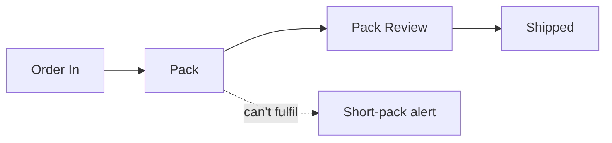

Use the business-analyst skill on this PRD from Harbour Supply, a ship
chandler. Write the package to leads/harbour-supply/ when you get there.

# Harbour Supply — PRD

Ships order provisions by email or phone. Today staff key orders into a
spreadsheet, pack from a paper list, and invoice when the signed paper
delivery order comes back, often weeks later.

## Warehouse operations

Orders move through stages on a phone in the warehouse.

- Order pipeline: each order moves Order In → Pack → Pack Review → Shipped.
- Short-pack alert: flag an item that cannot be packed.

## Invoicing

- Invoice from packed quantities, raised the moment an order is shipped.
- Payment status per invoice.
