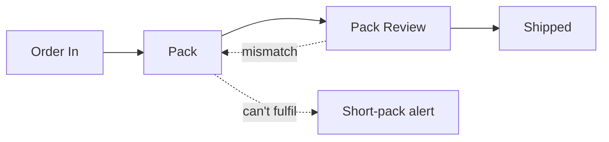
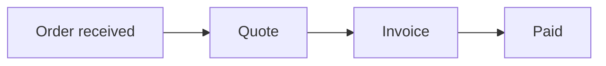
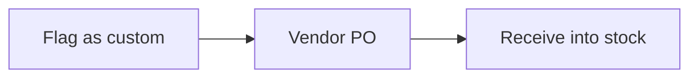

# Requirements — Sin Kowa (mini)

Source: PO brief, trimmed to two systems for tests.

## Part 1 — Discovery Brief

Problem: clients dispute charges after the ship sails and there is no record of what was packed.

| ID | Goal | Metric |
| --- | --- | --- |
| G-001 | Stop billing disputes after sailing | disputes per month down 50% in 6 months |

Constraints: CON-001 — vessels are offline at sea; delivery orders are signed on paper today.

## Part 2 — Process & Domain

As-is workflow WF-001 (order to invoice today): office staff (ACT-002) key the order in →
the packer (ACT-001) packs from a paper list → paper delivery order signed at the dock →
invoice raised when the paper returns.

| ID | Rule | Examples |
| --- | --- | --- |
| BR-001 | Invoice quantity equals packed-and-audited quantity | ordered 10, packed 8 → invoice 8 |

<!-- scope:start -->

### To-be scope

What we propose to build: 2 systems, each shown as its workflows and then the features that serve them.

| ID | System | Purpose | IMDA roadmap pillar |
| --- | --- | --- | --- |
| SYS-001 | Warehouse operations | Moves an order from intake to the dock; the one screen a warehouse worker needs. | Warehouse Automation |
| SYS-002 | Orders & invoicing | Quotation through to a paid invoice. | Finance/Documentation |

### SYS-001 Warehouse operations

Moves an order from intake to the dock; the one screen a warehouse worker needs. Replaces today's "Order to invoice today".

**Main workflow: WF-002 Order pipeline**

| ID | Feature | What it does | Where in the workflow | Requirements |
| --- | --- | --- | --- | --- |
| FEAT-001 | Order pipeline & stage engine | Moves an order through each stage, with task views per role | Order In → Pack → Pack Review → Shipped | FR-001 |
| FEAT-002 | Short-pack alert | Flags an item that cannot be packed, in time to buy or cancel | Short-pack alert | FR-002 |

### SYS-002 Orders & invoicing

Quotation through to a paid invoice. Replaces today's "Order to invoice today".

**Main workflow: WF-003 Order to cash**

**Sub-workflow: WF-004 Custom order** — starts at Order received, rejoins Order pipeline · about 20% of orders

| ID | Feature | What it does | Where in the workflow | Requirements |
| --- | --- | --- | --- | --- |
| FEAT-003 | Order intake & quotation | Captures email and phone orders and prices them | Order received → Quote; Flag as custom | FR-003 |
| FEAT-004 | Invoice from packed quantities | Raises the invoice from what was packed and shipped | Shipped (in Order pipeline); Invoice → Paid | FR-004 |
| FEAT-005 | One login, role-based screens | One login; packers see packing tasks, office staff see orders and invoices | every step | FR-005 |

<!-- scope:end -->

## Part 3 — Requirements

Scope — out: last-mile delivery tracking. Future: pallet labels.

| ID | Requirement | Label | Scope | Feature |
| --- | --- | --- | --- | --- |
| FR-001 | Move each order through Order In, Pack, Pack Review, Shipped | confirmed | in | Order pipeline & stage engine |
| FR-002 | Packer flags an item that cannot be packed; office alerted | confirmed | in | Short-pack alert |
| FR-003 | Enter an email or phone order and produce a quotation | confirmed | in | Order intake & quotation |
| FR-004 | Raise the invoice from packed-and-audited quantities | assumed | in | Invoice from packed quantities |
| FR-005 | One login; packers limited to packing tasks | confirmed | in | One login, role-based screens |
| FR-006 | Print a pallet label at Pack | assumed | future | — |

NFR-001 (availability, assumed): offline scans synced within 5 minutes of reconnecting.
INT-001: write invoices to the InvoiceNow network (recommended).
DAT-001: Order — commercial, about 300 per month (assumed).

## Part 4 — Acceptance Scenarios

| ID | Given | When | Then |
| --- | --- | --- | --- |
| SC-001 | an order of 10 items with 8 packed | the invoice is raised | it bills 8 items |

## Part 5 — Readiness Report

Readiness: 63%. Areas — businessContext 80, workflows 70, rules 60,
integrations 50, data 60, nfrs 60.

Open questions: Q-001 (P2) — invoice at shipping or at the signed delivery order?
Assumptions: ASM-001 (medium impact, unconfirmed) — packers carry a camera phone.
Blockers: none. Conflicts: none.
