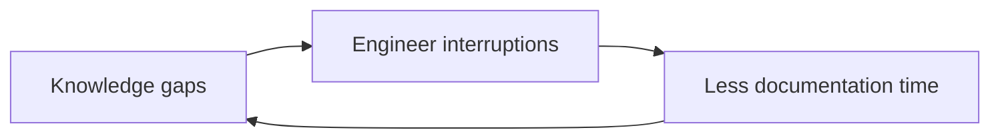

# Causal Loop

## When it fits

The input names the variables, and they are suspected of closing a loop.

## Process

You are executing the Causal Loop framework within the systems-thinking
skill. The deliverable is a set of labelled edges, and the labels carry
most of the value — an unlabelled causal diagram asserts causation it has
not earned.

1. List `variables`: the things that can go up or down. Take them from the
   input; do not invent a variable to complete a chain.
2. For each `link`, record the direction of influence and exactly one
   support label:
   - `correlation` — the input shows them moving together, nothing more.
   - `hypothesized` — you are proposing the causal direction.
   - `evidenced` — the input states or directly demonstrates the causation.
   A link with no label is an error. The three are never collapsed.
3. Extend a chain only while the next link names a variable already in
   `variables` or evidenced in the input. If the next link would introduce
   an unevidenced variable, the chain stops there.
4. A chain enters `loops` only when it closes on a variable already in the
   diagram. If it does not close, record it as an open chain and label it
   as one. Do not call it a loop.
5. For each loop, state whether it is reinforcing (the effect feeds the
   cause) or balancing (the effect dampens the cause), and name the link
   that makes it so.
6. Record a `delays` entry only where the input states a lag. An inferred
   delay is an `assumptions` entry, not a `delays` entry.

## Output block

Emit the `causal_loop` block from `references/contract.md`: `variables`,
`links`, `loops`, `delays`.

A closed loop is a cycle, so a run that produces one gets a Mermaid
diagram:

A run that produces only open chains has no cycle and gets prose.

## Stop when

Every chain has either closed into a loop or stopped at the link where the
next variable would be unevidenced.

Stopping at an unevidenced link is the framework working. A chain that runs
out of evidence has told you where the evidence ends, and that is a
finding. It is never extended with a guess to make a loop close.
