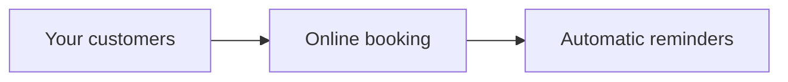

# Acme Corp — Proposal

## Executive Summary
Your customers book by phone today; every double-booking costs you a client. We will build an online booking system for $10,000 – $14,000.

## Background & Objectives
Acme staff manage appointments by hand. The goal: customers book online, reminders go out automatically, and no slot is ever double-booked.

## Proposed Solution
One new system with two parts: the booking page your customers see, and reminders that go out on their own.

## Scope
| Feature | What you get |
| --- | --- |
| Online booking | Customers pick a free slot; double-booking is impossible |
| Automatic reminders | Customers get an email before their appointment |

## Out of Scope & Assumptions
- Text-message reminders are not included.
- Recurring bookings are not included.
- We assume all bookings happen in a single timezone.

## Delivery Approach
Two milestones. M1 - Booking core comes first; M2 - Notifications follows. You see a working demo every week, and each milestone ends with your sign-off.

## Investment & Timeline
| Milestone | Investment |
| --- | --- |
| M1 - Booking core | $7,600 – $10,600 |
| M2 - Notifications | $2,400 – $3,400 |

**Total: $10,000 – $14,000**, or a single fixed price of $12,000 if you prefer one number. The range reflects estimation confidence; we confirm a fixed price before each milestone begins.

## About Code Engine Studio
We build custom software for small businesses. Recent work: a clinic scheduling system and a salon booking app. Contact: hello@codeenginestudio.com

## Next Steps
This proposal is valid until 2099-12-31. To proceed, reply with your acceptance and we schedule the kick-off call within one week.
